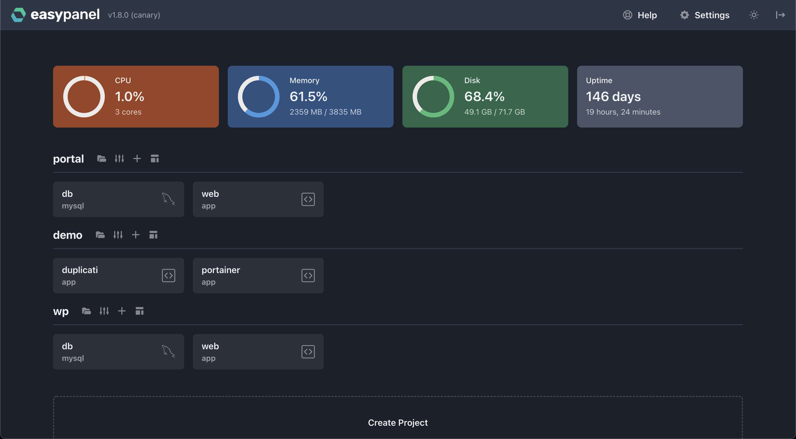

Happy Friday! I just wanted to give you a brief update on the latest features we’ve added to Easypanel.

## Resource Monitoring

One of the most requested features was resource monitoring. It’s finally here! While the most advanced users knew how to inspect and check out what is going on their servers, most users were running blind.

Now you can check the system-level stats on your dashboard. On top of that, you can check the service-level stats on the service page.

## New Dashboard

The previous dashboard was… boring. Instead of displaying just the list of your projects, now you can see all the services at the first glance.

## Other Improvements

- Support basic auth
- Better volumes/mounts
- Native MariaDB service
- Prune Docker images button
- Start/stop buttons for all services

## Docker Compose to Easypanel

From the beginning of the project, people were asking about `docker-compose.yml` support. While that is very tricky to implement directly, a member of our community built a tool to convert your `docker-compose.yml` to Easypanel Schema.

Kudos to Raven Brötzmann! Go ahead and checkout his tool and don’t forget to give a start on the Github repository.

- [https://compose-to-easypanel.netlify.app/](https://compose-to-easypanel.netlify.app)
- [https://github.com/ravenbroetzmann/compose-to-easypanel](https://github.com/ravenbroetzmann/compose-to-easypanel)

## 10+ New Templates

The community was very active lately. I want to thank each and every one of you for your contributions: Ponky (our first contributor!), Mark Topper, Raul Bedeoan, Ivan Ryan

Check out some of the new templates

- imgproxy
- Drone & Drone Runner
- Rocket.Chat
- Duplicati
- MySQL Backup
- Postgres Backup
- File Browser
- Docker Registry
- NextCloud
- UptimeKuma
- Whiteboard

## Join on Discord, Follow on Twitter

If you want to be the first to know about new features or new templates in Easypanel, you can join our Discord server. You can also follow us on Twitter. Links below 👇

- [Easypanel on Twitter](https://twitter.com/easypanel_io)
- [Easypanel on Discord](https://discord.com/invite/9bcDSXcZQ7)
