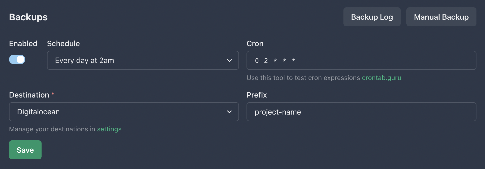

We've got some big news to share - database backups are finally available in Easypanel! We've been working hard on this feature, and we couldn't be more excited to offer it to all of our awesome users.

## Backups are Essential

Let's be real - data loss sucks. That's why backups are so important. With Easypanel's new database backup feature, you can rest easy knowing that your data is safe and sound. Whether you're dealing with data corruption, accidental deletion, or some other unforeseen issue, you can quickly restore your data and get back to business as usual.

## Works with Your Favorite Database

Easypanel's database backup feature is compatible with all database services, including MySQL, MariaDB, Postgres, and MongoDB. So no matter what database you're working with, you can easily back up your data without breaking a sweat.

## Store Your Backups in Cloud

You can store your backups with any S3 compatible storage provider. Here are a few of them: AWS S3, Digitalocean Spaces, Wasabi, Azure Blob, Google Cloud Storage, Backblaze B2, Minio, OpenStack Swift, IBM Cloud Object Storage. This gives you the flexibility to choose the storage provider that works best for you.

## Set It and Forget It

Running backups manually can be a pain, which is why we've made it easy to schedule backups at regular intervals. This way, you can set it and forget it, knowing that your data is always backed up and secure.

## Upcoming Improvements

We're not done yet - we're always working to make our platform better. We'll be working on some new improvements, including the ability to restore backups directly from Easypanel and to automatically prune old backups.

## Try It Out Today

So there you have it - Easypanel's new database backup feature. We hope you'll give it a try and let us know what you think. As always, we appreciate your feedback and are committed to making our platform the best it can be. Thanks for being a part of the Easypanel community!

## Join on Discord, Follow on Twitter

If you want to be the first to know about new features or new templates in Easypanel, you can join our Discord server. You can also follow us on Twitter. Links below 👇

- [Easypanel on Twitter](https://twitter.com/easypanel_io)
- [Easypanel on Discord](https://discord.com/invite/9bcDSXcZQ7)
