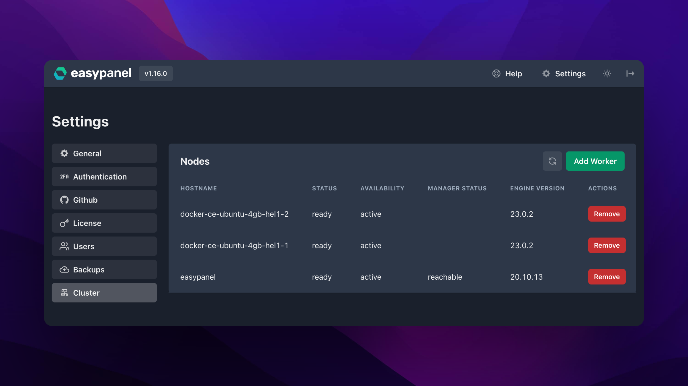

We are thrilled to announce our latest development - multi-server support! This highly-requested feature will significantly benefit our business users.

## One Manager Node, Multiple Worker Nodes

Under the hood, Easypanel utilizes Docker Swarm. Our newest implementation now enables you to add multiple worker nodes. When deploying services, the workload will be evenly distributed across all your servers. If you happen to remove a worker node, the workload from that server will be automatically redistributed amongst the remaining nodes.

Please note that Easypanel currently does not support multiple manager nodes, meaning you will not achieve a fully redundant infrastructure. If redundancy is essential for your use case, you can set up two separate Easypanel clusters and place a managed load balancer in front of them.

## Ideal for Stateless Services

Multi-server support is best suited for stateless services - those which do not store any data on the local disk or can afford data loss upon restart.

It is crucial to design your applications in such a way that they can effectively leverage stateless services as much as possible. There are numerous strategies for accomplishing this, one of which includes utilizing object storage services like AWS S3 or self-hosted MinIO.

## License Enforcement on the Horizon

During the beta phase, our multi-server support is accessible for everyone to try. However, as we transition towards a stable release, this feature will be exclusively available to users with business licenses.

Starting from May 1st, license enforcement will be in effect. Premium features will then become accessible only for servers with active licenses.

## Stay Connected

If you want to stay up-to-date with new features or template releases in Easypanel, join our Discord server and follow us on Twitter. Find the links below 👇

- [Easypanel on Twitter](https://twitter.com/easypanel_io)
- [Easypanel on Discord](https://discord.com/invite/9bcDSXcZQ7)
