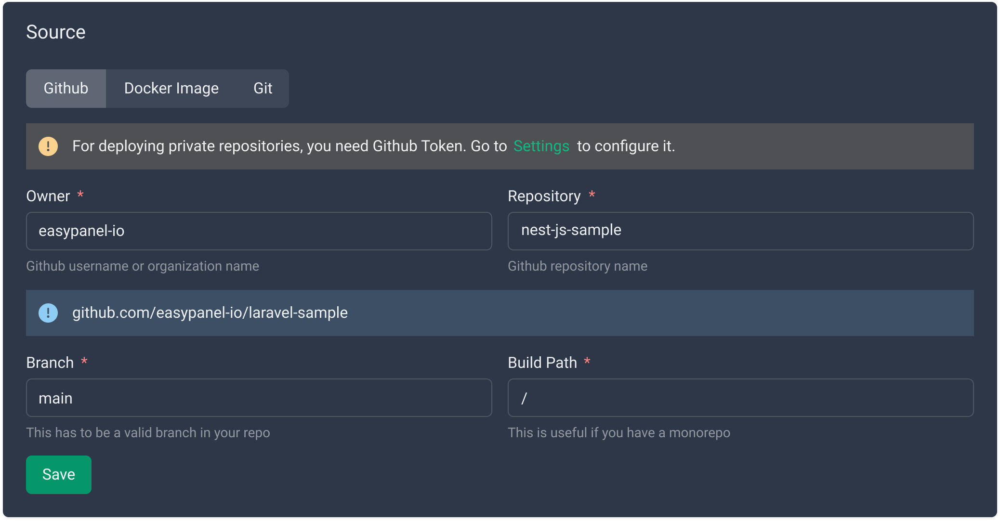
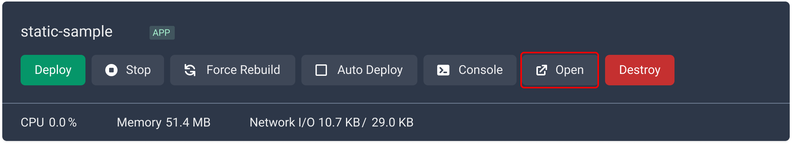

# Hosting a Static Website with Easypanel

In this guide we will take you through the process of hosting a static website on Easypanel. You have two options available: using a Git repository or a Docker image. Let's dive into the steps involved:

## Prerequisites

Before we begin, make sure you have the following:

- An existing static website project ([sample codebase](https://github.com/easypanel-io/static-site-sample)).
- Easypanel account credentials.

## Step 1 - Creating a New Project

Firstly, log in to your Easypanel account and create a new project:

- Click on the "New" button and select the "App" option.

## Step 2 - Configuring General Settings

After creating the app, you will be redirected to the app's page where you can configure the general settings:

- If you have a Git repository, fill out the required information and save your changes.

  - If the repository is public, no additional configuration is needed.
  - If it is private, follow the instructions provided to set up your access key.

- If you have a Docker image, switch to the "Docker Image" tab and provide the necessary details.

## Step 3 - Setting up Git SSH Key (If Applicable)

If you are using a Git provider such as GitHub, GitLab, or Bitbucket, follow these steps to set up your SSH key:

- Refer to the [SSH key setup guide](https://easypanel.io/docs/code-sources/git-ssh) for detailed instructions.

## Step 4 - Choosing NixPacks as the Build Method

Ensure that you have selected NixPacks as the build method:

- Save your selection to apply the changes.

## Step 5 - Deploying Your Website

Now, it's time to deploy your static website:

- Click the "Deploy" button located at the top of the page to initiate the deployment process.

## Step 6 - Accessing Your Website

After a successful deployment, your static website will be live and accessible. Simply visit the provided public URL to access your website.

## Conclusion

Congratulations! You have successfully hosted your static website on Easypanel. Enjoy the benefits of hassle-free website management and leverage Easypanel's user-friendly features. If you encounter any issues or have further questions, feel free to seek assistance from the Easypanel support team. Happy hosting!
