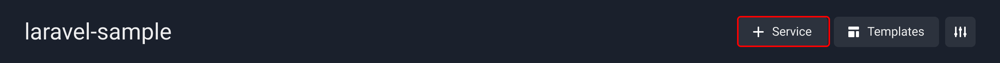
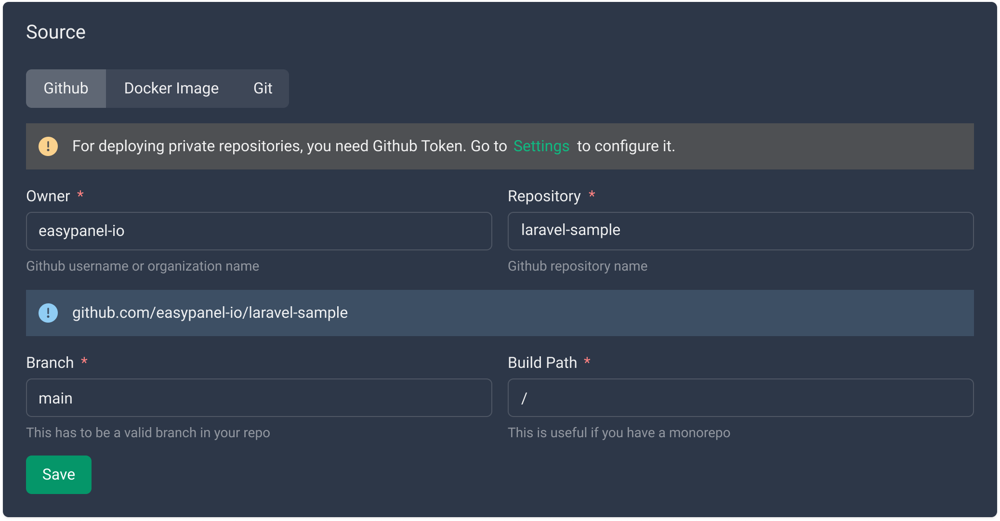
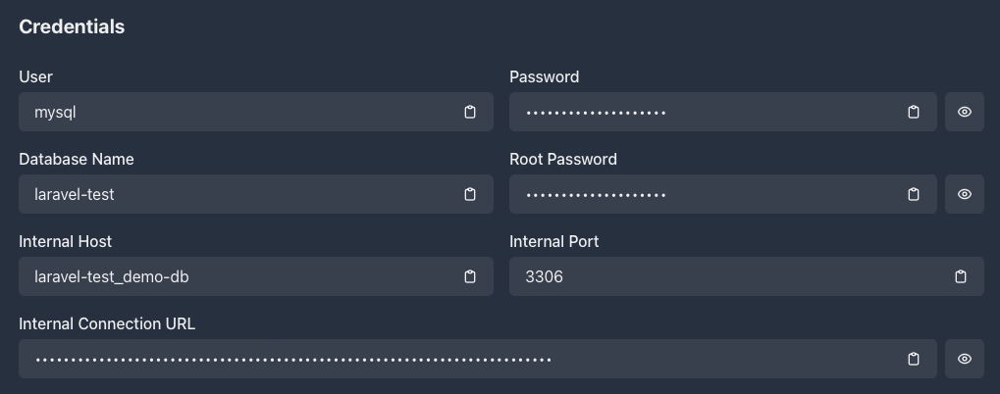
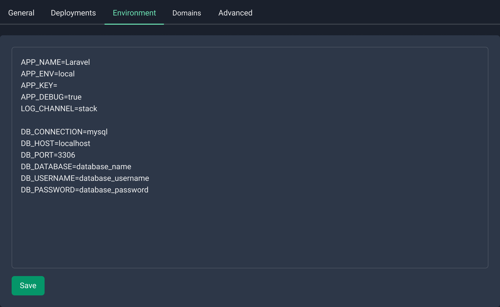
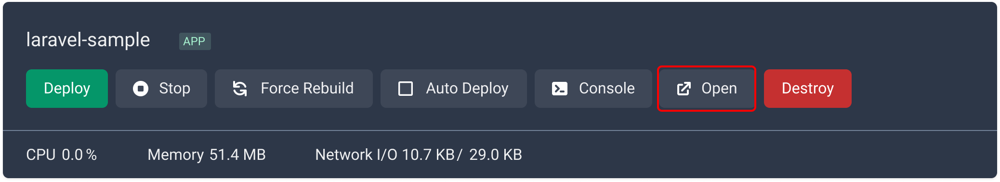

# Laravel

Laravel is a popular web application framework built with PHP, which provides an excellent structure for developing robust and scalable web applications. Easypanel is a web hosting control panel that simplifies web hosting management, automating several tasks, including server creation, application deployment, and configuration management.

In this guide, we aim to provide a detailed step-by-step approach to deploying a Laravel application on Easypanel. After following the steps below, you will have a Laravel application running and accessible via a publicly accessible URL.

## Prerequisites

Before we begin, ensure you have the following:

- A Laravel application running smoothly on your local machine ([sample codebase](https://github.com/easypanel-io/laravel-sample)).
- Easypanel running on your server.

## Step 1 - Creating a New Project on Easypanel

The first step is to create a new project from Easypanel. To achieve this, follow the steps below:

1. Log in to your Easypanel account.
2. Click on "New" to create a new project.
3. Specify the project's name.
4. Click on "Create" to complete the process.


## Step 2 - Setting up Your Application Service

Once you have obtained your new project, the next step is to set up your application service. The application service represents your Laravel application, and you can set it up quickly by following the steps below:

1. Within the project dashboard, click on "+ Service"
2. Select "App" and specify the service's name and domain.

:::info

You can leave the domain blank and Easypanel will **generate** a subdomain for you.

:::



## Step 3 - Configuring the Git/GitHub Source

If you plan to deploy your Laravel application from a repository, you must set up the Git repository source. Easypanel supports Git and GitHub to facilitate your automation process.

If you are using a private repository we suggest following the [Git SSH guide](/docs/code-sources/git-ssh)



## Step 4 - Choosing the Build Method

Easypanel allows you to deploy your Laravel application using two methods:

- Nixpacks: This is a package manager that simplifies building web applications for PHP developers. You can use Nixpacks to define the environment for your Laravel application and build it automatically.
- Dockerfile: Docker is a containerization technology that allows you to package your Laravel application with all its dependencies and deploy it as a container. You can use Dockerfile to define the environment for your Laravel application and build it automatically.

Follow the steps below to select your build method:

1. Navigate to the "Build" tab within your application service.
2. Choose either Nixpacks or Dockerfile and configure it according to your preferences and needs.
3. Save the changes, and a prompt will appear with the option to "Deploy."
4. Click on "Deploy" to initiate your deployment process.


## Step 5 - Configuring the Database

In order to configure your database you would have to first create a database service.

From the project's page you can click on "+ Service" and choose your database of choice, in this example we will use a MySQL database.


After you click on the MySQL card you will have to set a name and a password for your database. If you leave the password field empty Easypanel will generate a password for you.


As soon as you created the database you will be redirected to the service's page, where you will be able to get the information needed for the next step.



## Step 6 - Setting up Your Environment

Every Laravel application has an `.env` file that contains all the environment variables required for smooth operation. Use the "Environment" tab to set up your environment variables. Follow the steps below:

1. Navigate to the "Environment" tab within your application service.
2. Set your environment variables by specifying the key-value pairs as desired.
3. Add Nixpacks specific variables for Laravel
   ```
   NIXPACKS_PHP_ROOT_DIR=/app/public
   NIXPACKS_PHP_FALLBACK_PATH=/index.php
   ```
4. Save the changes to complete the process.
5. Press "Deploy" to apply the changes in your running app.



## Step 7 - Accessing and Testing Your Application

Once your application is deployed, you can access it using the public URL generated by Easypanel.



## Conclusion

Easypanel is an excellent hosting solution that simplifies the process of deploying web applications. By following the steps outlined in this guide, you can deploy your Laravel application in no time. Remember to keep your application up to date and secure to maintain smooth operations.
