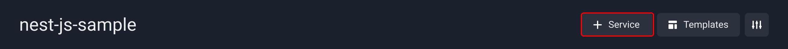
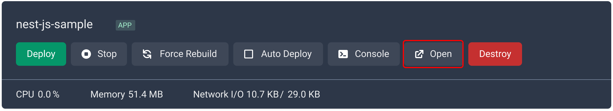

# Nest.js

Nest.js is a popular web application framework built with Node.js and TypeScript, offering a scalable and modular approach to developing server-side applications. Easypanel is a user-friendly web hosting control panel that simplifies server management, including deployment and configuration of web applications. This guide will walk you through deploying a Nest.js application on Easypanel, allowing you to access it via a public URL.

## Prerequisites

Before you begin, ensure you have the following:

- An existing Nest.js application on your local machine.
- Easypanel installed and running on your server.

## Step 1 - Creating a New Project on Easypanel

1. Log in to your Easypanel account.
2. Click the "New" button to create a new project.
3. Provide a name for your project.
4. Click "Create" to complete the project creation process.

## Step 2 - Setting up Your Application Service

After creating the project, proceed with setting up your application service, which represents your Nest.js application:

1. Within the project dashboard, click "+ Service."
2. Choose "App" as the service type.

## Step 3 - Configuring the Git/GitHub Source

If you plan to deploy your Nest.js application from a repository, configure the Git repository source in Easypanel:

## Step 4 - Choosing the Build Method

For deploying your Nest.js application, you have two recommended methods:

- Nixpacks: A package manager that simplifies building Node.js applications. You can use Nixpacks to define the environment for your Nest.js application and automate the build process.
- Dockerfile: Docker is a containerization technology that allows you to package your Nest.js application with its dependencies and deploy it as a container. You can use a Dockerfile to define the environment for your Nest.js application and automate the build process.

To select your build method:

1. Go to the "Build" tab within your application service.
2. Choose either Nixpacks or Dockerfile based on your preferences and requirements.
3. Configure the selected method as needed.
4. Save your changes, and a prompt to "Deploy" will appear.
5. Click "Deploy" to initiate the deployment process.

If you choose to deploy your app using a Dockerfile, you will need to specify the relative path to the Dockerfile inside your repository.

## Step 5 - Setting up Your Environment

Configure the environment variables required for your Nest.js application using Easypanel's "Environment" tab:

1. Navigate to the "Environment" tab within your application service.
2. Define the necessary key-value pairs for your environment variables.
3. Save the changes to apply the environment configurations.
4. Press "Deploy" to ensure the changes take effect in your running application.

## Step 6 - Accessing and Testing Your Application

Once the deployment is complete, your Nest.js application will be accessible through the public URL generated by Easypanel.

## Conclusion

Easypanel simplifies the process of deploying web applications, making it an ideal hosting solution for your Nest.js application. By following the steps outlined in this guide, you can successfully deploy your Nest.js application on Easypanel and make it available through a public URL. Don't forget to regularly update and secure your application to ensure smooth and secure operations.

If you encounter any issues or have further questions, don't hesitate to refer to Easypanel's documentation or seek assistance from their support team. They will be able to provide you with the necessary guidance to resolve any issues you may encounter.

Congratulations on successfully deploying your Nest.js application on Easypanel! Enjoy the benefits of easy server management and seamless hosting. Remember to keep your Nest.js application updated and secure to ensure its smooth and reliable operation.

If you have any further questions or need additional support, feel free to reach out. Happy hosting!
