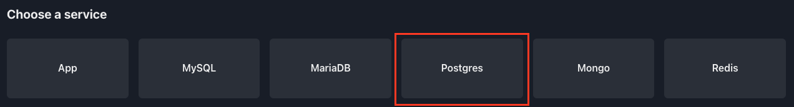
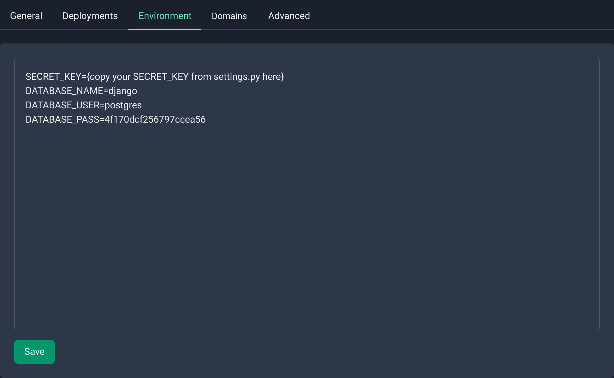

# Django

Django is a popular web framework built with Python, known for its simplicity and efficiency in developing robust web applications. Easypanel is a user-friendly web hosting control panel that simplifies server management, including the deployment and configuration of web applications. This guide will take you through the process of deploying a Django application on Easypanel, making it accessible via a public URL.

## Prerequisites

Before you begin, make sure you have the following:

- An operational Django application on your local machine ([sample codebase](https://github.com/easypanel-io/django-sample)).
- Easypanel installed and running on your server.

## Step 1 - Creating a New Project on Easypanel

1. Log in to your Easypanel account.
2. Click on the "New" button to create a new project.
3. Provide a name for your project.
4. Click on "Create" to complete the project creation process.


## Step 2 - Setting up Your Application Service

After creating the project, proceed with setting up your application service, which represents your Django application:

1. Within the project dashboard, click on "+ Service."
2. Select "App" as the service type.


## Step 3 - Configuring the Git/GitHub Source

If you plan to deploy your Django application from a repository, configure the Git repository source in Easypanel:


## Step 4 - Choosing the Build Method

Easypanel offers two methods to deploy your Django application:

- Nixpacks: A package manager that simplifies building Python applications. You can use Nixpacks to define the environment for your Django application and build it automatically.
- Dockerfile: Docker is a containerization technology that allows you to package your Django application with its dependencies and deploy it as a container. You can use a Dockerfile to define the environment for your Django application and build it automatically.

To select your build method:

1. Go to the "Build" tab within your application service.
2. Choose either Nixpacks or Dockerfile based on your preferences and requirements.
3. Configure the selected method as needed.
4. Save your changes, and a prompt to "Deploy" will appear.
5. Click on "Deploy" to initiate the deployment process.

If you are using a Dockerfile, specify the relative path to the Dockerfile inside your repository.


## Step 5 - Configuring the Database

In order to configure your database you would have to first create a database service.

:::caution
If your application has a SQLite database you don't have to worry about setting up a database service as your database.
:::

From the project's page you can click on "+ Service" and choose your database of choice, in this example we will use a MySQL database.


After you click on the Postgres card you will have to set a name and a password for your database. If you leave the password field empty Easypanel will generate a password for you.



As soon as you created the database you will be redirected to the service's page, where you will be able to get the information needed for the next step.


## Step 6 - Setting up Your Environment

Before settings up your environment variables you have to configure your app in a way that supports

```bash
pip install django-environ
```

now inside `settings.py` import environ and initialise it:

```python
import environ
# Initialise environment variables
env = environ.Env()
environ.Env.read_env()
```

Your Django application can now read environment variables. Replace all references to your environment variables in `settings.py`:

```python
DATABASES = {
    ‘default’: {
    ‘ENGINE’: ‘django.db.backends.postgresql_psycopg2’,
    ‘NAME’: env(‘DATABASE_NAME’),
    ‘USER’: env(‘DATABASE_USER’),
    ‘PASSWORD’: env(‘DATABASE_PASS’),
    }
}
```

And

```python
SECRET_KEY = env(‘SECRET_KEY’)
```

Configure the environment variables required for your Django application using Easypanel's "Environment" tab:

1. Navigate to the "Environment" tab within your application service.
2. Define the necessary key-value pairs for your environment variables.
3. Save the changes to apply the environment configurations.
4. Press "Deploy" to ensure the changes take effect in your running application.



## Step 7 - Accessing and Testing Your Application

Once the deployment is complete, your Django application will be accessible through the public URL generated by Easypanel.


## Conclusion

Easypanel simplifies the process of deploying web applications, making it an ideal hosting solution for your Django application. By following the steps outlined in this guide, you can successfully deploy your Django application on Easypanel and make it available through a public URL. Remember to regularly update and secure your application to ensure smooth and secure operations.

If you encounter any issues or have further questions, don't hesitate to refer to Easypanel's documentation or seek assistance from their support team. Happy hosting!
