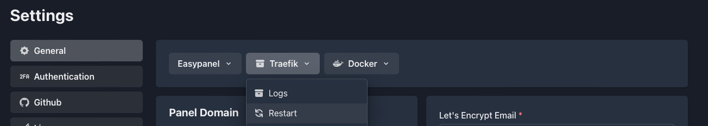

# Custom Traefik Configuration

In this guide, we will focus on creating a custom configuration file for Traefik on Easypanel. Follow the steps below to create the `custom.yaml` file.

## Step 1 - Creating the "custom.yaml" File

1. Open your terminal or command prompt.
2. Navigate to the traefik config directory.

```
cd /etc/easypanel/traefik/config/
```

3. Use your preferred text editor to create a new file named `custom.yaml` in that directory. For example:

```
sudo nano /etc/easypanel/traefik/config/custom.yaml
```

This command will open the `custom.yaml` file in the nano text editor. If you prefer to use a different text editor like vim or emacs, replace `nano` with your preferred editor.

4. Begin configuring your custom Traefik settings in the `custom.yaml` file. You can refer to the [Traefik documentation](https://doc.traefik.io/traefik/routing/overview/) for more details on available configuration options.

5. Save the file and exit the text editor.

## Step 2 - Restarting Traefik

Restart Traefik using the appropriate command for your operating system and installation method. Head to settings and click the restart button:



## Step 3 - Verifying the Configuration

After restarting Traefik, it is essential to verify that your custom configuration is working as expected. You can check the Traefik logs for any errors or warnings that might indicate configuration issues.

## Conclusion

Congratulations! You have successfully created a custom configuration file for Traefik on Easypanel. By following these steps, you can customize Traefik to meet your specific requirements and optimize its functionality for your applications. If you encounter any difficulties or have further questions, don't hesitate to consult the Traefik documentation or seek assistance from Easypanel's support team.
