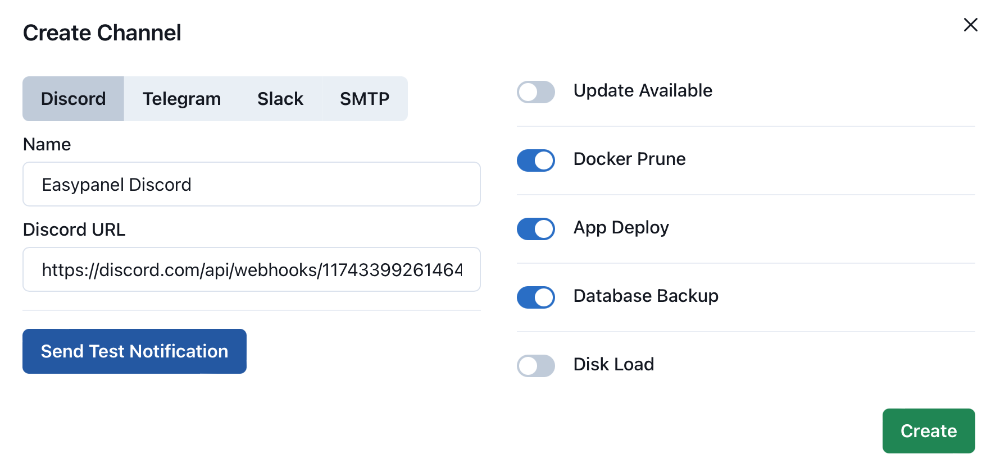

# Notifications

🚀 **Exciting News!** EasyPanel just rolled out a game-changing feature: **Notifications!** 📢 Now, you can effortlessly stay informed about crucial events in your system. Whether it's a successful app deployment, a completed database backup, Docker pruning, exceeding disk load thresholds, or a new update release – we've got you covered.

Connect with ease via **Discord, Telegram, Slack, or Email,** and take control of your system like never before! 🔔 Don't miss a beat – upgrade to the latest version of EasyPanel now!

## Discord

To receive timely notifications on your Discord server through EasyPanel, follow these simple steps:

1. **Create a Webhook on Discord:**

   - Go to your Discord server and navigate to the desired channel.
   - Click on the gear icon next to the channel name, then select **Integrations**.
   - In the **Webhooks** section click on **View Webhooks** and then **New Webhook**
   - Customize the webhook name, avatar, and channel (if needed), and click **Copy Webhook URL**.

2. **Configure EasyPanel:**

   - Open EasyPanel and navigate to the **Settings / Notifications**.
   - Click on **Add Channel** and select the Discord tab
   - Paste the copied Webhook URL into the Discord URL field.
   - Configure the events that you'd like to receive a notification for, in the righ side of the pop-up.

:::info
Your configuration should look similar to this:

:::

3. **Test Your Connection:**

   - Click on the "Send Test Notification" button to ensure EasyPanel can successfully communicate with your Discord channel.

4. **Save Changes:**
   - Once the test is successful, save your changes to activate Discord notifications.

Now, EasyPanel will keep you in the loop by posting notifications directly to your Discord server whenever an app is deployed, a database is backed up, Docker is pruned, disk load exceeds a set percentage, or a new update is available. Enjoy seamless communication and stay informed effortlessly!

## Slack

To receive notifications on your Slack workspace through EasyPanel, follow these straightforward steps:

1. **Create a Webhook on Slack:**

   - Visit **[https://api.slack.com/apps](https://api.slack.com/apps)** and log in to your Slack workspace.
   - Click on "Create New App" and give your app a name.
   - In the left sidebar, select "Incoming Webhooks" under "Features."
   - Activate incoming webhooks and click on "Add New Webhook to Workspace."

2. **Configure EasyPanel:**

   - Open EasyPanel and navigate to the **Settings / Notifications**.
   - Click on **Add Channel** and select the Slack tab.
   - Paste the copied Webhook URL into the Slack URL field.
   - Configure the events that you'd like to receive notifications for, in the right side of the pop-up.

3. **Test Your Connection:**

   - Click on the "Send Test Notification" button to ensure EasyPanel can successfully communicate with your Slack workspace.

4. **Save Changes:**

   - Once the test is successful, save your changes to activate Slack notifications.

Now, EasyPanel will keep you in the loop by posting notifications directly to your Slack workspace whenever an app is deployed, a database is backed up, Docker is pruned, disk load exceeds a set percentage, or a new update is available. Stay connected effortlessly and manage your system with ease! 🔔🚀

## Telegram

Easily integrate EasyPanel notifications into your Telegram group by following these simple steps:

1. **Create a Telegram Bot:**

   - Visit [BotFather on Telegram](https://t.me/BotFather) and start a chat.
   - Use the `/newbot` command to create a new bot. Follow the prompts to set a username for your bot.
   - BotFather will provide you with a unique **Bot Token**. Keep this token secure, you'll need it shortly.

2. **Invite the Miss Rose Bot to Your Group:**

   - Invite the [@MissRose_bot](https://t.me/MissRose_bot) to your Telegram group by clicking on the link and selecting your group.

3. **Configure EasyPanel:**

   - Open EasyPanel and navigate to the **Settings / Notifications**.
   - Click on **Add Channel** and select the Telegram tab.
   - Enter the Bot Token you received from BotFather into the **Bot Access Token** field.
   - Type `/id` in your group chat using the [@MissRose_bot](https://t.me/MissRose_bot) to get the **Chat ID**. Copy and paste this ID into the "Chat ID" field in EasyPanel.
   - Configure the events that you'd like to receive notifications for.

4. **Test Your Connection:**

   - Click on the "Send Test Notification" button to verify that EasyPanel can successfully send notifications to your Telegram group.

5. **Save Changes:**

   - Once the test is successful, save your changes to activate Telegram notifications.

Now, EasyPanel will keep you informed in real-time through your Telegram group whenever an app is deployed, a database is backed up, Docker is pruned, disk load exceeds a set percentage, or a new update is available. Effortlessly manage your system and stay connected with EasyPanel! 🔔🌐

## Email

Receive important EasyPanel notifications directly to your email inbox by following these simple steps:

1. **Configure SMTP Settings:**

   - Open EasyPanel and navigate to the **Settings / Notifications**.
   - Click on **Add Channel** and select the SMTP tab.
   - Enter your SMTP server details, including the server address, port, and authentication credentials.
   - Configure the recipients (the addresses Easypanel will send the emails to).

2. **Configure Notification Events:**

   - Choose the events for which you want to receive notifications, such as app deployment, database backup completion, Docker pruning, exceeding disk load thresholds, or new update availability.

3. **Test Your Connection:**

   - Click on the "Send Test Notification" button to ensure EasyPanel can successfully send emails to your configured address.

4. **Save Changes:**

   - Once the test is successful, save your changes to activate Email notifications.

Now, EasyPanel will keep you in the loop by sending notifications directly to your email whenever specified events occur. Stay informed and manage your system effortlessly with EasyPanel! 🔔📧
