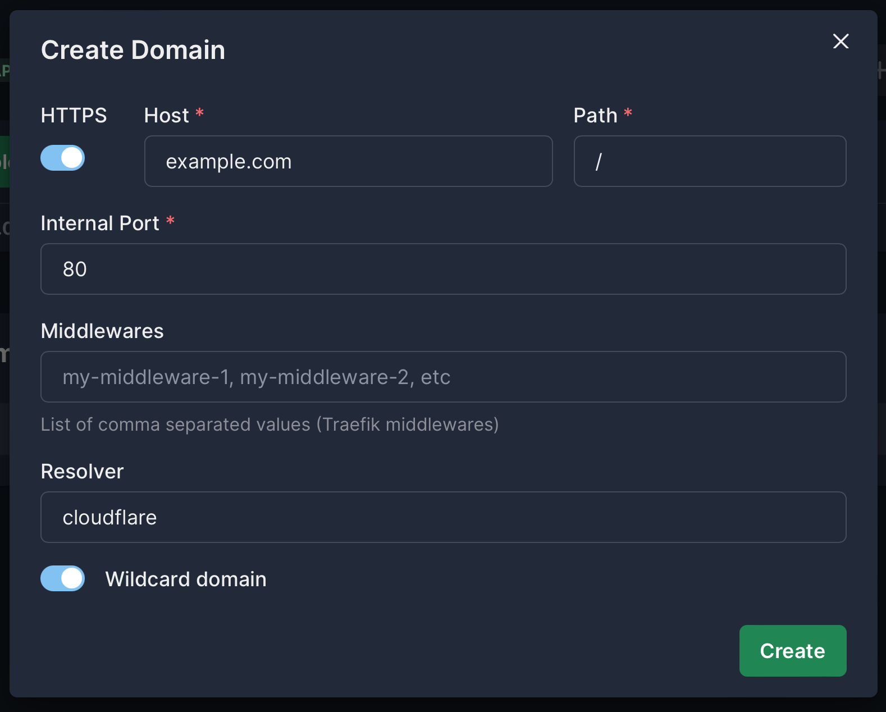

# Setting Up a Wildcard Domain

In this guide, we'll walk you through the process of configuring a wildcard domain in Easypanel. Follow these steps to successfully set up your wildcard domain.

## Step 1 - Create a Certificate Resolver

Go to "Settings", "Traefik", and then "Environment", and add the following environment variables:

```env
TRAEFIK_CERTIFICATESRESOLVERS_<RESOLVER_NAME>_ACME_EMAIL=
TRAEFIK_CERTIFICATESRESOLVERS_<RESOLVER_NAME>_ACME_STORAGE="/data/acme.json"
TRAEFIK_CERTIFICATESRESOLVERS_<RESOLVER_NAME>_ACME_DNSCHALLENGE_PROVIDER=
TRAEFIK_CERTIFICATESRESOLVERS_<RESOLVER_NAME>_ACME_DNSCHALLENGE_RESOLVERS=1.1.1.1,8.8.8.8
```

Replace `<RESOLVER_NAME>` with your desired name. Then add your email address and the DNS provider you are using. The DNS provider should be one of the supported providers listed in the [Official Traefik Documentation](https://doc.traefik.io/traefik/https/acme/#providers).

:::caution
All the ACME resolvers must use the same email address.
:::

## Step 2 - Set Credentials for Your Provider

For the DNS challenge to work, you need to set the credentials for your DNS provider. Each provider has its own set of credentials. You can find the required credentials in the [Official Traefik Documentation](https://doc.traefik.io/traefik/https/acme/#providers).

For example, if you are using Digital Ocean, you need to set the `DO_AUTH_TOKEN` environment variable.

After this, make sure to restart the Traefik service.

## Step 3 - Create Your Wildcard Domain

Now, go to your app "Domains" and click "Add Domain". You need to enable the "Wildcard domain" option and set the resolver name you created in Step 1.

:::caution
If you want to point your root domain and subdomains to your service, you need to create 2 separate domains. One for the root domain and another for the subdomains (wildcard domain).
:::



## Conclusion

Following the steps outlined in this guide, you can easily set up a Wildcard Domain on Easypanel. If you have any questions or need further assistance, feel free to reach out to us on our Discord channel.
