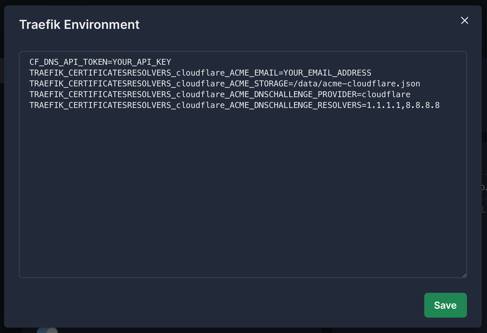

# Setting Up a Wildcard Domain

In this guide, we'll walk you through the process of configuring a wildcard domain in Easypanel. Follow these steps to successfully set up your wildcard domain.

For detailed instructions on configuring your Traefik variables for any available provider, refer to the [Official Traefik Documentation](https://doc.traefik.io/traefik/https/acme/#dnschallenge). For this guide, we'll use Cloudflare as an example.

## Step 1 - Configure Your Traefik Environment

1. Open the Traefik environment editor from settings inside Easypanel.

:::info
Replace `YOUR_API_KEY` with your Cloudflare DNS API key and `YOUR_EMAIL_ADDRESS` with your actual email address.
:::

## Step 2 - Create Your Wildcard Domain

Go to your service domains page inside your Easypanel instance and click "Add Domain".

:::caution
**If you activate the Wildcard domain option**, only **\*.example.com** will point to your service. To have both **example.com** and **\*.example.com** point to your service, you need to create **2 separate domains**.
:::

## Conclusion

Following the steps outlined in this guide, you can easily set up a Wildcard Domain on Easypanel. If you have any questions or need further assistance, feel free to reach out to us on our Discord channel.
