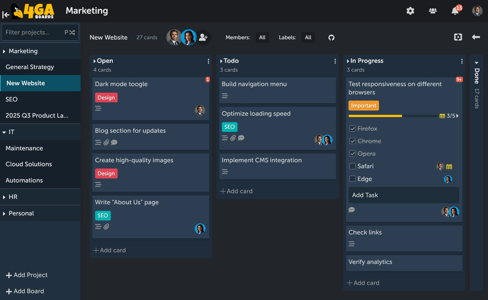

<!-- generated -->

# 4ga Boards

1-Click installation template for 4ga Boards on Easypanel

## Description

4ga Boards is a modern, open-source project management and collaboration platform inspired by Trello. It provides a powerful Kanban-style board system for organizing tasks, projects, and workflows. With its intuitive drag-and-drop interface, 4ga Boards makes it easy to visualize work, track progress, and collaborate with teams. The application features customizable boards, lists, and cards, along with support for attachments, user avatars, and project backgrounds. Built with modern web technologies, 4ga Boards offers a seamless experience for managing projects of any size. It&#39;s perfect for teams looking for a self-hosted alternative to commercial project management tools, providing full control over your data and workflows. Whether you&#39;re managing software development sprints, marketing campaigns, or personal todo lists, 4ga Boards provides the flexibility and features you need.

## Instructions

Default credentials are demo/demo. Change the password after first login.

## Benefits

- Self-Hosted Control: Take full control of your project management data by hosting 4ga Boards on your own infrastructure, ensuring privacy and data sovereignty for your team.
- Kanban Workflow: Visualize your work with intuitive Kanban boards that make it easy to track tasks, manage workflows, and see progress at a glance with drag-and-drop functionality.
- Team Collaboration: Collaborate effectively with your team through shared boards, task assignments, and real-time updates that keep everyone aligned and productive.
- Customizable Boards: Personalize your workspace with custom board backgrounds, user avatars, and flexible organization structures that adapt to your team's unique workflow.

## Features

- Kanban Boards: Create and manage multiple boards with customizable lists and cards for organizing tasks and projects using the proven Kanban methodology.
- Drag and Drop: Intuitive drag-and-drop interface makes it easy to move cards between lists, reorder tasks, and reorganize your workflow without any friction.
- File Attachments: Attach files and documents directly to cards, keeping all project-related materials organized and accessible in one central location.
- User Avatars: Personalize your workspace with custom user avatars that help team members quickly identify who's working on what and build team identity.
- Project Backgrounds: Customize board appearance with project background images that help distinguish different projects and make your workspace more visually appealing.
- PostgreSQL Database: Built on reliable PostgreSQL database backend ensuring data integrity, performance, and scalability for teams of any size.
- Modern Interface: Clean, responsive web interface built with modern technologies provides an excellent user experience across desktop and mobile devices.
- Open Source: Fully open-source project allows you to customize, extend, and contribute to the platform while benefiting from community-driven improvements.

## Links

- [Website](https://4gaboards.com/#home)
- [Documentation](https://docs.4gaboards.com)
- [GitHub](https://github.com/RARgames/4gaboards)
- [Template Source](https://github.com/easypanel-io/templates/tree/main/templates/4gaboards)

## Options

Name | Description | Required | Default Value
-|-|-|-
App Service Name | - | yes | 4gaboards
App Service Image | 4ga Boards Docker image from GitHub Container Registry | yes | ghcr.io/rargames/4gaboards:3.3.2

## Screenshots

## Change Log

- 2025-10-23 – Initial Template Release
- 2026-02-23 – Version bumped to v3.3.2

## Contributors

- [Ahson Shaikh](https://github.com/Ahson-Shaikh)
