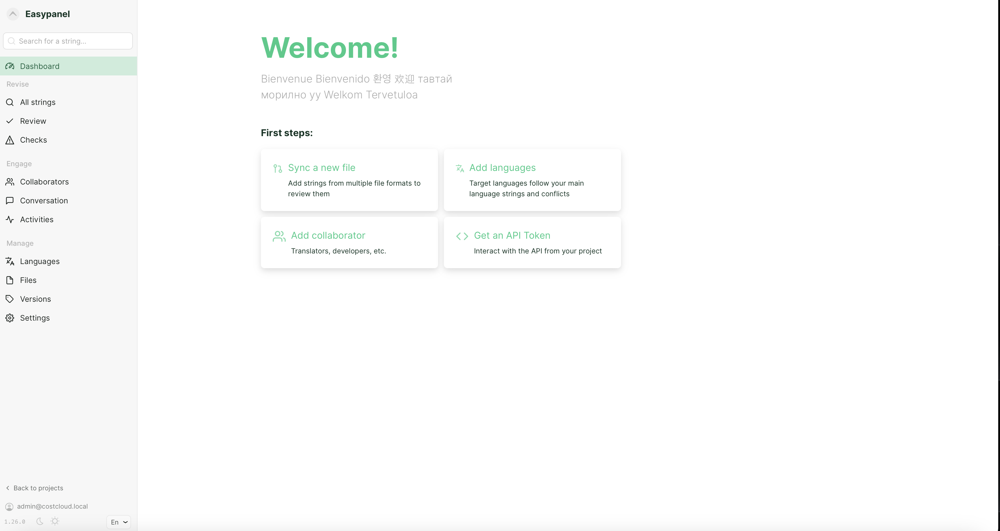

<!-- generated -->

# Accent

1-Click installation template for Accent on Easypanel

## Description

Accent is a free and open-source web-based collaboration platform for translation and localization projects. It provides a clean interface for translators to work together on various file formats including JSON, YAML, Properties, Gettext PO, and many more. Accent supports real-time collaboration, version control integration, and automated workflows to streamline the translation process. It features role-based access control, translation memory, and comprehensive reporting tools to help manage translation projects efficiently.

## Benefits

- Real-time Collaboration: Multiple translators can work on the same project simultaneously with real-time updates and conflict resolution.
- Version Control Integration: Seamlessly integrates with Git repositories to sync translations with your development workflow.
- Multiple File Formats: Supports JSON, YAML, Properties, Gettext PO, and many other translation file formats.
- Translation Memory: Leverage previous translations to speed up the translation process and ensure consistency across projects.
- API and CLI Tools: Comprehensive API and command-line tools for automation and integration with existing development workflows.

## Links

- [Website](https://www.accent.reviews)
- [Documentation](https://www.accent.reviews/guides/getting-started)
- [GitHub](https://github.com/mirego/accent)
- [Template Source](https://github.com/easypanel-io/templates/tree/main/templates/accent)

## Options

Name | Description | Required | Default Value
-|-|-|-
App Service Name | - | yes | accent
App Service Image | - | yes | mirego/accent:v1.29.0

## Screenshots

## Change Log

- 2025-07-14 – Initial template release
- 2026-04-29 – Version bumped to v1.29.0

## Contributors

- [Ahson Shaikh](https://github.com/Ahson-Shaikh)
