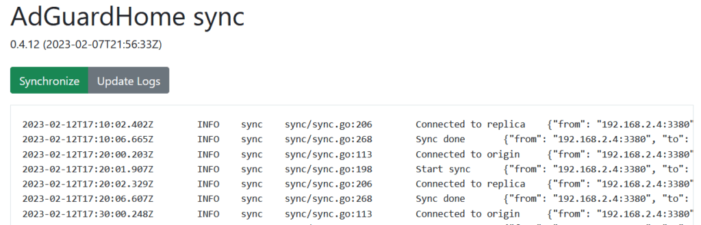

<!-- generated -->

# AdGuard Home Sync

1-Click installation template for AdGuard Home Sync on Easypanel

## Description

AdGuard Home Sync is a tool designed to synchronize filters, blocklists, and configuration between multiple AdGuard Home instances. It allows you to maintain consistent filtering across different AdGuard Home deployments by synchronizing configuration from an origin instance to one or more replica instances.

## Instructions

Modify the config file to add your own AdGuard Home instances and cron schedule.

## Benefits

- Consistent Filtering: Maintain consistent filtering rules across multiple AdGuard Home instances automatically.
- Automated Synchronization: Set it and forget it with customizable cron schedules that keep your AdGuard Home instances in sync without manual intervention.
- Centralized Management: Manage your filtering rules from a single origin instance and have them propagate to all your replica instances.

## Features

- Multi-Instance Synchronization: Sync configuration from one origin AdGuard Home instance to one or more replica instances.
- Scheduled Synchronization: Configure how frequently synchronization occurs using cron expressions.
- API Access: Access the synchronization process via a secure API with basic authentication.

## Links

- [Documentation](https://github.com/bakito/adguardhome-sync/wiki/FAQ)
- [Github](https://github.com/bakito/adguardhome-sync)
- [Template Source](https://github.com/easypanel-io/templates/tree/main/templates/adguardhome-sync)

## Options

Name | Description | Required | Default Value
-|-|-|-
App Service Name | - | yes | adguardhome-sync
App Service Image | - | yes | lscr.io/linuxserver/adguardhome-sync:0.9.0
API Username | - | yes | username
API Password | - | yes | password

## Screenshots

## Change Log

- 2025-05-09 – first release
- 2026-04-29 – Version bumped to 0.9.0

## Contributors

- [Ahson Shaikh](https://github.com/Ahson-Shaikh)
