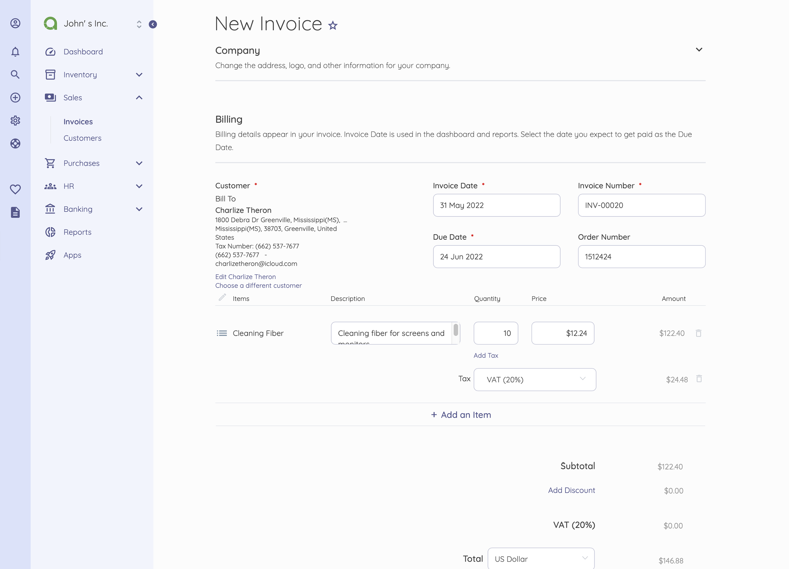

<!-- generated -->

# Akaunting

1-Click installation template for Akaunting on Easypanel

## Description

Akaunting is a powerful online accounting software designed for small businesses, 
freelancers, and entrepreneurs. This free and open-source solution provides 
comprehensive financial management tools with a modern, user-friendly interface. 
Built on Laravel, it offers robust double-entry bookkeeping, real-time financial 
tracking, and automated features to streamline your accounting processes. With 
multi-user support, document management, and detailed reporting capabilities, 
Akaunting helps you maintain professional financial records while saving time 
and resources.

## Benefits

- Professional Accounting Made Simple: Akaunting simplifies professional accounting with an intuitive interface
and automated features, making it easy for non-accountants to maintain
accurate financial records.

- Free and Open-Source: As a free, open-source solution, Akaunting eliminates expensive software
costs while giving you full control over your financial data and the
freedom to modify the software to suit your needs.

- Secure and Self-Hosted: Host Akaunting on your own infrastructure for complete data privacy and
security. You maintain full control over your sensitive financial information
with no third-party access.

## Features

- Double-Entry Bookkeeping: Built on professional accounting principles, Akaunting provides comprehensive
double-entry bookkeeping to ensure accurate financial records and maintain
compliance with accounting standards.

- Invoice & Bill Management: Create professional invoices, track bills, and manage payments efficiently.
Automated features help you stay on top of accounts receivable and payable.

- Financial Reporting: Generate detailed financial reports including profit & loss statements,
balance sheets, and tax summaries. Get real-time insights into your
business's financial health.

- Multi-User & Multi-Company: Support for multiple users and companies makes Akaunting perfect for
growing businesses or accountants managing multiple clients.

## Links

- [Github](https://github.com/akaunting/akaunting)
- [Documentation](https://akaunting.com/docs)
- [Website](https://akaunting.com)
- [Template Source](https://github.com/easypanel-io/templates/tree/main/templates/akaunting)

## Options

Name | Description | Required | Default Value
-|-|-|-
App Service Name | - | yes | akaunting
Company Name | - | yes | My Company
Company Email | - | yes | company@example.com
Admin Email | - | yes | admin@example.com
Admin Password | - | yes | 

## Screenshots

## Change Log

- 2025-02-14 – First release with Akaunting 3.0.20

## Contributors

- [ShayPunter](https://github.com/shaypunter)
