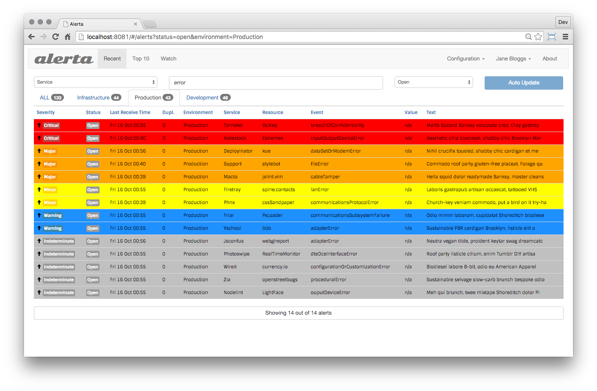

<!-- generated -->

# Alerta

1-Click installation template for Alerta on Easypanel

## Description

Alerta is a monitoring system that consolidates and deduplicates alerts from multiple monitoring systems.

## Benefits

- Alert Management: Consolidates and deduplicates alerts from multiple monitoring systems.
- User Management: Built-in user authentication and authorization system.
- API Access: RESTful API for integration with other systems.

## Features

- Alert Consolidation: Deduplicates and consolidates alerts from multiple sources.
- Authentication: Built-in authentication system with admin user management.
- API Integration: RESTful API for integration with monitoring systems.
- Database Integration: PostgreSQL database integration for reliable data storage.
- Containerized: Easy to deploy and manage in containerized environments.

## Links

- [Website](https://alerta.io/)
- [Github](https://github.com/alerta/alerta)
- [Documentation](https://docs.alerta.io/)
- [Template Source](https://github.com/easypanel-io/templates/tree/main/templates/alerta)

## Options

Name | Description | Required | Default Value
-|-|-|-
App Service Name | - | yes | alerta
App Service Image | Image to use for the app service | yes | alerta/alerta-web:9.0.4
Admin Users | Comma-separated list of admin user email addresses | yes | admin@alerta.io
Admin Password | Password for admin users | yes | super-secret
Admin Key | API key assigned to the first admin user | yes | demo-key
Admin Key Max Age | Maximum age of admin API key in days | yes | 500

## Screenshots

## Change Log

- 2025-05-08 – First Release

## Contributors

- [Ahson Shaikh](https://github.com/Ahson-Shaikh)
