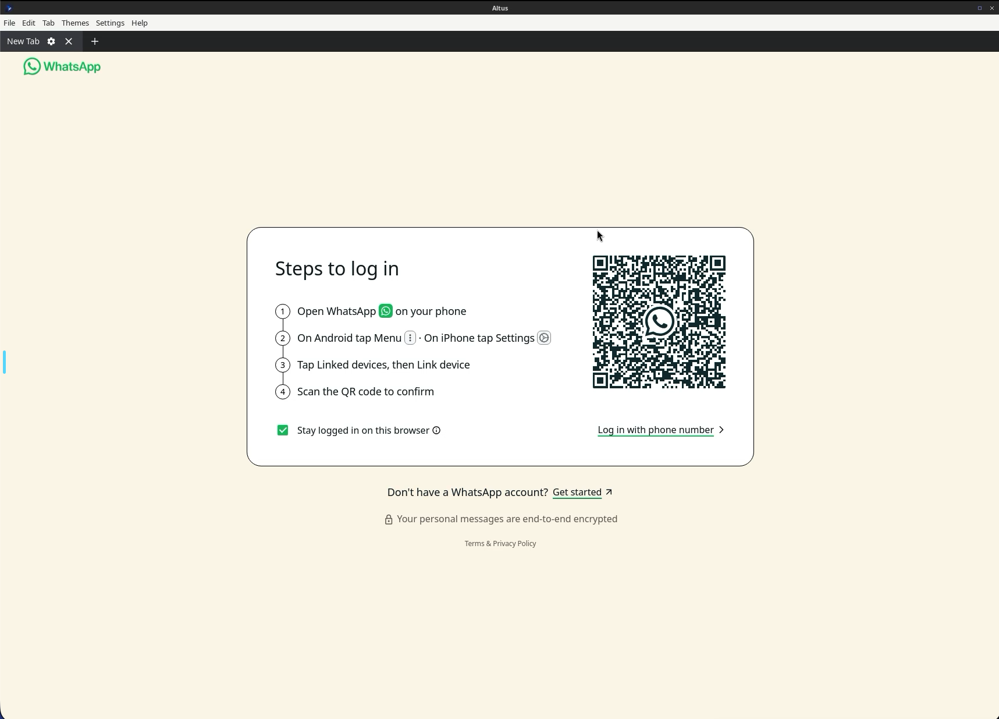

<!-- generated -->

# Altus

1-Click installation template for Altus on Easypanel

## Description

Altus is a desktop application that brings WhatsApp Web to your desktop with additional features and customization options. It provides a clean, native desktop experience for WhatsApp Web, with support for multiple accounts, themes, and enhanced functionality beyond the standard web interface.

## Benefits

- Enhanced WhatsApp Experience: Access WhatsApp Web with additional features and customization options.
- Multi-Account Support: Manage multiple WhatsApp accounts from a single desktop application.
- Native Desktop Feel: Enjoy a native desktop application experience instead of browser tabs.

## Features

- WhatsApp Web Desktop: Provides WhatsApp Web functionality in a dedicated desktop application.
- Theme Customization: Customize the appearance with various themes and interface options.
- Enhanced Notifications: Better notification management compared to browser-based WhatsApp Web.
- Multi-Instance Support: Support for multiple WhatsApp accounts simultaneously.

## Links

- [Documentation](https://docs.linuxserver.io/images/docker-altus/)
- [Github](https://github.com/linuxserver/docker-altus)
- [Template Source](https://github.com/easypanel-io/templates/tree/main/templates/altus)

## Options

Name | Description | Required | Default Value
-|-|-|-
App Service Name | - | yes | altus
App Service Image | - | yes | lscr.io/linuxserver/altus:5.7.2

## Screenshots

## Change Log

- 2025-06-06 – Template Release (v5.7.1)
- 2026-02-23 – Version bumped to v5.7.2

## Contributors

- [Ahson Shaikh](https://github.com/Ahson-Shaikh)
