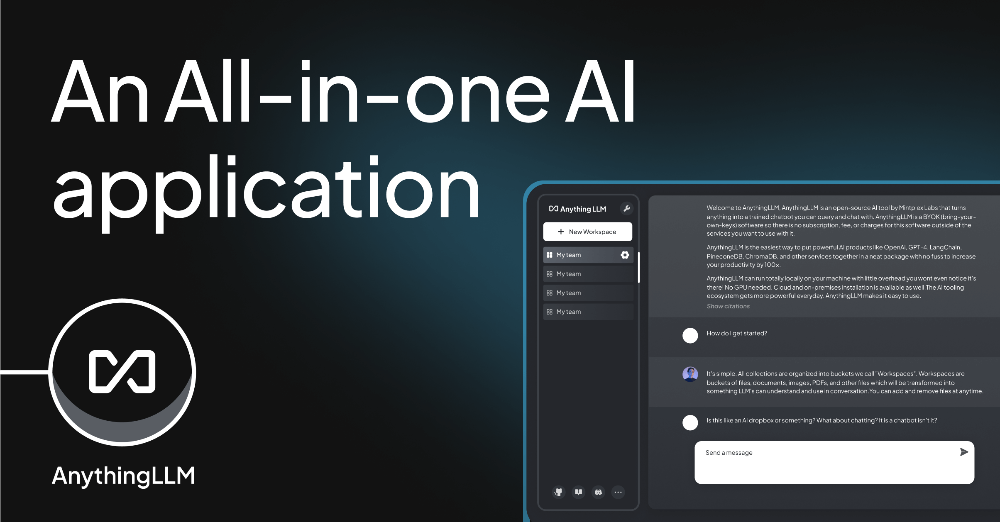

<!-- generated -->

# Anything-LLM

1-Click installation template for Anything-LLM on Easypanel

## Description

Anything-LLM is an open-source, AI-powered platform that enables users to leverage Large Language Models (LLMs) for creating, managing, and querying custom knowledge bases. It provides seamless integration with OpenAI services, offering a robust, flexible, and extensible environment for LLM-driven applications. Ideal for developers and organizations, Anything-LLM streamlines the deployment of intelligent AI solutions.

## Benefits

- Build Custom Knowledge Bases: Anything-LLM allows you to create and query your own knowledge bases, powered by Large Language Models for accurate and intelligent responses.
- Easy Integration with OpenAI: Simplify setup with seamless integration of OpenAI API keys, enabling quick and efficient deployment of LLM-powered workflows.
- Extensible and Customizable: Anything-LLM offers a flexible and developer-friendly architecture, allowing customization of features, APIs, and workflows to suit your specific needs.

## Features

- Knowledge Base Management: Easily upload, manage, and query your documents to create a tailored knowledge base using powerful LLM integrations.
- OpenAI API Integration: Connect to OpenAI’s models effortlessly for natural language processing, delivering precise and intelligent results.
- Access Control and Security: Secure your instance with access codes, ensuring only authorized users can interact with your custom knowledge bases.
- Containerized Deployment: Easily deploy Anything-LLM in containerized environments like Docker for scalability and flexibility.
- User-Friendly Interface: Enjoy a clean and intuitive UI that simplifies the process of managing and querying your knowledge base, ensuring an excellent user experience.

## Links

- [Website](https://anythingllm.com/)
- [Compose Docs](https://docs.anythingllm.com/installation-docker/local-docker)
- [Documentation](https://docs.anythingllm.com/)
- [Github](https://github.com/mintplex-labs/anything-llm)
- [Template Source](https://github.com/easypanel-io/templates/tree/main/templates/anythingllm)

## Options

Name | Description | Required | Default Value
-|-|-|-
App Service Name | - | yes | anything-llm
App Service Image | - | yes | mintplexlabs/anythingllm

## Screenshots

## Change Log

- 2024-12-16 – First release

## Contributors

- [Ahson Shaikh](https://github.com/Ahson-Shaikh)
