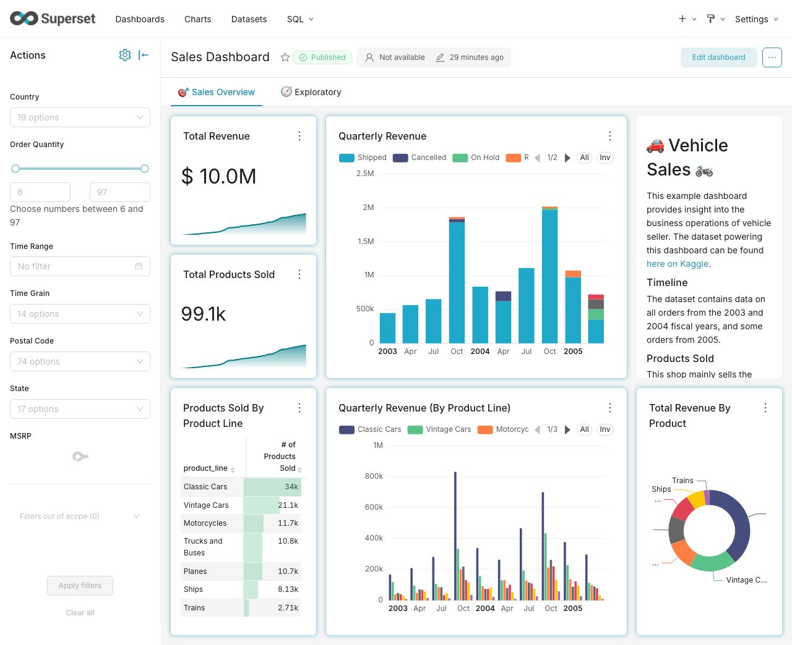
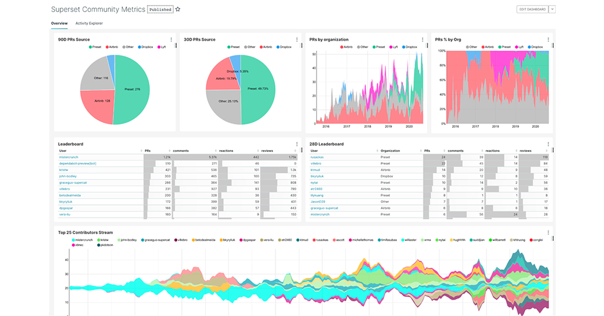

<!-- generated -->

# Apache Superset

1-Click installation template for Apache Superset on Easypanel

## Description

Apache Superset is a modern, enterprise-ready business intelligence web application. It&#39;s fast, lightweight, intuitive, and loaded with options that make it easy for users of all skill sets to explore and visualize their data, from simple line charts to highly detailed geospatial charts.

## Instructions

Migrate database with &quot;superset db upgrade&quot;, adjust roles and permissions with &quot;superset init&quot;, create admin user with &quot;superset fab create-admin&quot;. Follow the guide for further references.

## Benefits

- Data Visualization: Create beautiful, interactive visualizations of your data.
- SQL Editor: Powerful SQL editor with syntax highlighting and autocomplete.
- Dashboard Creation: Create and share interactive dashboards with your team.
- Data Exploration: Explore and analyze your data with an intuitive interface.
- Enterprise Ready: Scalable and secure solution for business intelligence.

## Features

- Rich Visualizations: Wide variety of visualization types to represent your data.
- SQL Lab: Advanced SQL editor for data exploration and preparation.
- Dashboard Builder: Drag-and-drop interface for creating interactive dashboards.
- Security: Role-based access control and authentication options.
- Data Source Integration: Connect to various data sources including SQL databases.

## Links

- [Github](https://github.com/apache/superset)
- [Documentation](https://superset.apache.org/docs/intro)
- [Guide](https://www.restack.io/docs/superset-knowledge-apache-superset-default-login)
- [Template Source](https://github.com/easypanel-io/templates/tree/main/templates/apache-superset)

## Options

Name | Description | Required | Default Value
-|-|-|-
App Service Name | - | yes | apache-superset
App Service Image | - | yes | apache/superset:6.0.0

## Screenshots

## Change Log

- 2024-04-22 – First Release
- 2026-04-03 – Update to 6.0.0

## Contributors

- [Ahson Shaikh](https://github.com/Ahson-Shaikh)
