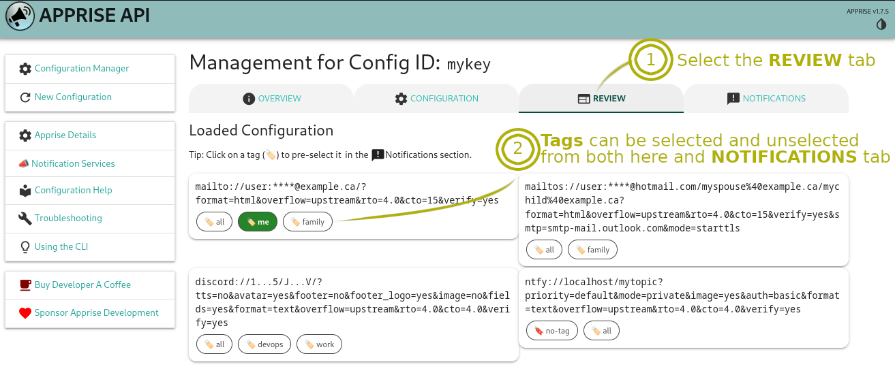

<!-- generated -->

# Apprise-API

1-Click installation template for Apprise-API on Easypanel

## Description

Apprise-API is an open-source notification gateway that provides a unified and straightforward way to send notifications to a variety of services, including email, SMS, chat apps, and more. It supports dozens of platforms out of the box, making it an ideal solution for developers and organizations seeking a robust, flexible, and extensible notification system. With a lightweight and API-driven design, Apprise-API simplifies integration into any project.

## Benefits

- Unified Notification Gateway: Apprise-API allows you to send notifications across multiple platforms, including email, SMS, chat apps, and more, from a single API.
- Extensive Platform Support: With built-in support for dozens of services, Apprise-API ensures seamless integration with your preferred notification platforms.
- Lightweight and Scalable: The lightweight design of Apprise-API makes it easy to deploy in containerized environments, ensuring scalability and flexibility.

## Features

- Multi-Platform Notifications: Send notifications to email, SMS, chat apps, and other platforms with minimal configuration.
- Open-Source and Extensible: Apprise-API’s open-source architecture allows developers to customize and extend functionality to meet their specific needs.
- RESTful API: Utilize a simple RESTful API to integrate Apprise-API into any application or workflow for easy notification management.
- Secure and Reliable: Built with security in mind, Apprise-API ensures that notifications are delivered securely and reliably to the desired platforms.
- Containerized Deployment: Easily deploy Apprise-API using Docker for quick setup and scalability.

## Links

- [Github](https://github.com/caronc/apprise-api)
- [Template Source](https://github.com/easypanel-io/templates/tree/main/templates/apprise-api)

## Options

Name | Description | Required | Default Value
-|-|-|-
App Service Name | - | yes | apprise-api
App Service Image | - | yes | linuxserver/apprise-api:latest

## Screenshots

## Change Log

- 2025-01-27 – First release

## Contributors

- [Ahson Shaikh](https://github.com/Ahson-Shaikh)
