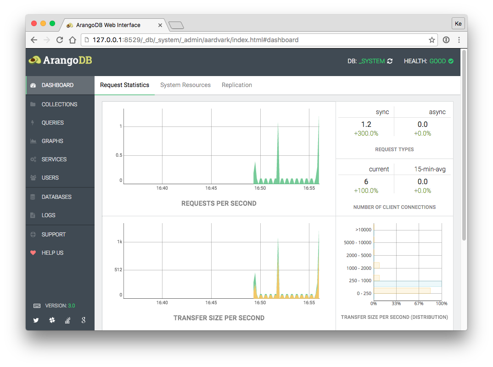

<!-- generated -->

# ArangoDB

1-Click installation template for ArangoDB on Easypanel

## Description

ArangoDB is a multi-model NoSQL database system that supports graph, document, and key-value data models. It is designed for scalability, high availability, and flexibility, making it suitable for a wide range of applications, from simple document storage to complex graph processing. ArangoDB offers a native query language (AQL), full-text search capabilities, a built-in HTTP API, and a web-based UI for management. It also provides features like replication, sharding, and ACID transactions to ensure data integrity and performance. With its integrated search engine and support for multi-tenancy, ArangoDB is an ideal choice for both small projects and enterprise-level applications.

## Instructions

Login using username; root and password specified in the envs.

## Benefits

- Multi-Model Database: ArangoDB supports multiple data models, including document, graph, and key-value, allowing developers to use a single database for diverse application needs.
- Scalable and High Availability: With built-in clustering, replication, and sharding, ArangoDB ensures high availability and scalability for enterprise-level applications.
- Rich Querying Capabilities: ArangoDB provides AQL (ArangoDB Query Language), a powerful query language that supports complex queries, graph traversals, and full-text search.

## Features

- Native Graph Support: ArangoDB offers a robust graph database engine with native graph traversal and pattern matching, making it ideal for social networks, recommendation engines, and fraud detection.
- ACID Transactions: ArangoDB ensures data integrity with full support for ACID transactions, making it a reliable choice for critical applications.
- Integrated Search Engine: With ArangoSearch, ArangoDB provides full-text search, ranking, and filtering capabilities, enhancing search-driven applications.
- HTTP API and Web UI: ArangoDB includes a built-in HTTP API and a web-based UI for easy database management and administration.
- Flexible Deployment Options: ArangoDB can be deployed as a single instance, in a cluster, or in Kubernetes environments for optimal scalability and reliability.

## Links

- [Documentation](https://www.arangodb.com/docs/stable/)
- [Github](https://github.com/arangodb/arangodb)
- [Template Source](https://github.com/easypanel-io/templates/tree/main/templates/arangodb)

## Options

Name | Description | Required | Default Value
-|-|-|-
App Service Name | - | yes | arangodb
App Service Image | - | yes | arangodb:3.12.4

## Screenshots

## Change Log

- 2025-02-03 – First Release

## Contributors

- [Ahson Shaikh](https://github.com/Ahson-Shaikh)
