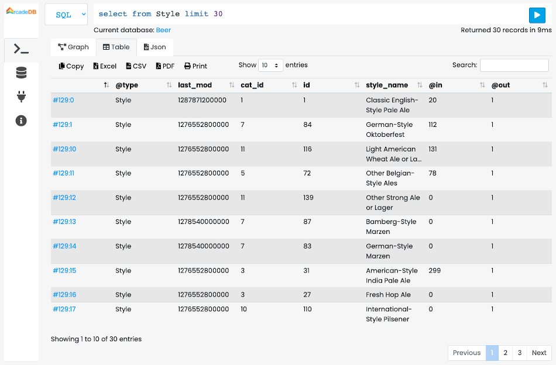

<!-- generated -->

# ArcadeDB

1-Click installation template for ArcadeDB on Easypanel

## Description

ArcadeDB is a multi-model database that supports multiple data models including Document, Graph, Key-Value, and Vector databases in a single engine. It&#39;s designed for high-performance applications with ACID transactions and real-time analytics capabilities.

## Benefits

- Multi-Model Database: Support for Document, Graph, Key-Value, and Vector databases in a single engine, eliminating the need for multiple database systems.
- High Performance: Built for high-performance applications with optimized data structures and efficient query processing.
- ACID Transactions: Full ACID compliance ensuring data consistency and reliability for critical applications.
- Real-time Analytics: Built-in support for real-time analytics and complex queries with powerful indexing capabilities.
- Open Source: Completely open-source with an active community, providing transparency and customization options.

## Features

- Document Database: Store and query JSON-like documents with flexible schema and powerful indexing options.
- Graph Database: Native graph database capabilities for complex relationship queries and graph analytics.
- Key-Value Store: High-performance key-value storage for caching and simple data retrieval scenarios.
- Vector Database: Support for vector operations and similarity search for AI and machine learning applications.
- SQL Support: Full SQL support with extensions for graph and document operations, making it familiar for developers.
- REST API: Comprehensive REST API for easy integration with web applications and microservices.

## Links

- [Website](https://arcadedb.com/)
- [Documentation](https://docs.arcadedb.com/)
- [Github](https://github.com/ArcadeData/arcadedb)
- [Template Source](https://github.com/easypanel-io/templates/tree/main/templates/arcadedb)

## Options

Name | Description | Required | Default Value
-|-|-|-
App Service Name | - | yes | arcadedb
App Service Image | - | yes | arcadedata/arcadedb:25.7.1
Binary Port | - | no | 2480

## Screenshots

## Change Log

- 2025-08-26 – First release

## Contributors

- [Ahson Shaikh](https://github.com/Ahson-Shaikh)
