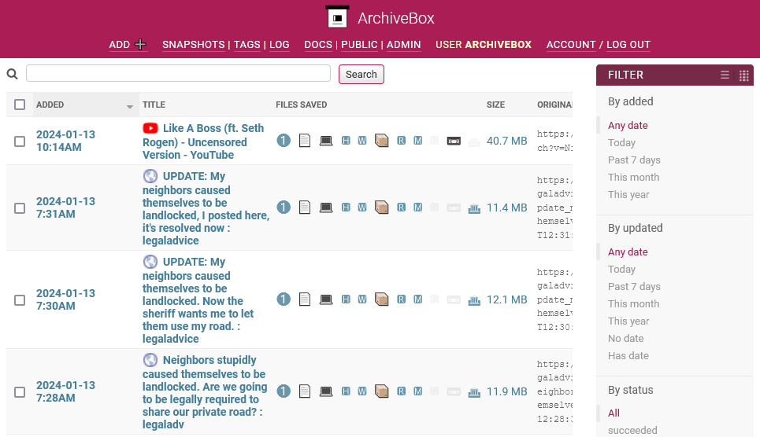

<!-- generated -->

# ArchiveBox

1-Click installation template for ArchiveBox on Easypanel

## Description

ArchiveBox is a self-hosted open-source internet archiving solution that allows you to save and browse webpages offline. It enables users to store full snapshots of web pages, including HTML, media, PDFs, and more, preserving them for future reference. ArchiveBox supports various input formats such as bookmarks, RSS feeds, and browser history, making it easy to automate and manage archiving tasks. The web interface provides a structured way to browse archived content, perform full-text searches, and organize saved snapshots efficiently. Additionally, it offers integrations with other tools, supports multiple storage backends, and provides API access for advanced automation.

## Instructions

To create superuser, take the console, and do &quot;su archivebox &amp;&amp; archivebox manage createsuperuser&quot;

## Benefits

- Webpage Archiving: ArchiveBox allows you to save full snapshots of web pages, including text, media, and interactive elements. This ensures long-term access to content even if the original webpage is deleted or altered.
- Multiple Input Sources: Users can archive content from various sources, such as bookmarks, browser history, RSS feeds, and direct URLs. This flexibility makes it ideal for researchers, journalists, and data preservationists.
- Full-Text Search & Browsing: ArchiveBox provides a powerful full-text search engine and an intuitive web interface to browse, tag, and organize archived content efficiently.

## Features

- Multi-Format Archiving: ArchiveBox saves pages in multiple formats, including HTML, screenshots, PDFs, and WARC files, ensuring robust long-term preservation.
- Automation & API Access: ArchiveBox provides an API for programmatic archiving, allowing seamless integration with other tools and automated workflows.
- Private & Public Archives: Users can control access by setting public or private modes, ensuring that sensitive data remains secure while allowing sharing of curated content.
- Full-Text Search: The system enables fast and efficient search across archived content, making it easy to retrieve specific information.
- Self-Hosted & Open Source: ArchiveBox is self-hosted and fully open-source, giving users complete control over their data without relying on third-party services.

## Links

- [Documentation](https://github.com/ArchiveBox/ArchiveBox/wiki)
- [Github](https://github.com/ArchiveBox/ArchiveBox)
- [Template Source](https://github.com/easypanel-io/templates/tree/main/templates/archivebox)

## Options

Name | Description | Required | Default Value
-|-|-|-
App Service Name | - | yes | archivebox
App Service Image | - | yes | archivebox/archivebox:0.7

## Screenshots

## Change Log

- 2025-03-18 – First Release

## Contributors

- [Ahson Shaikh](https://github.com/Ahson-Shaikh)
