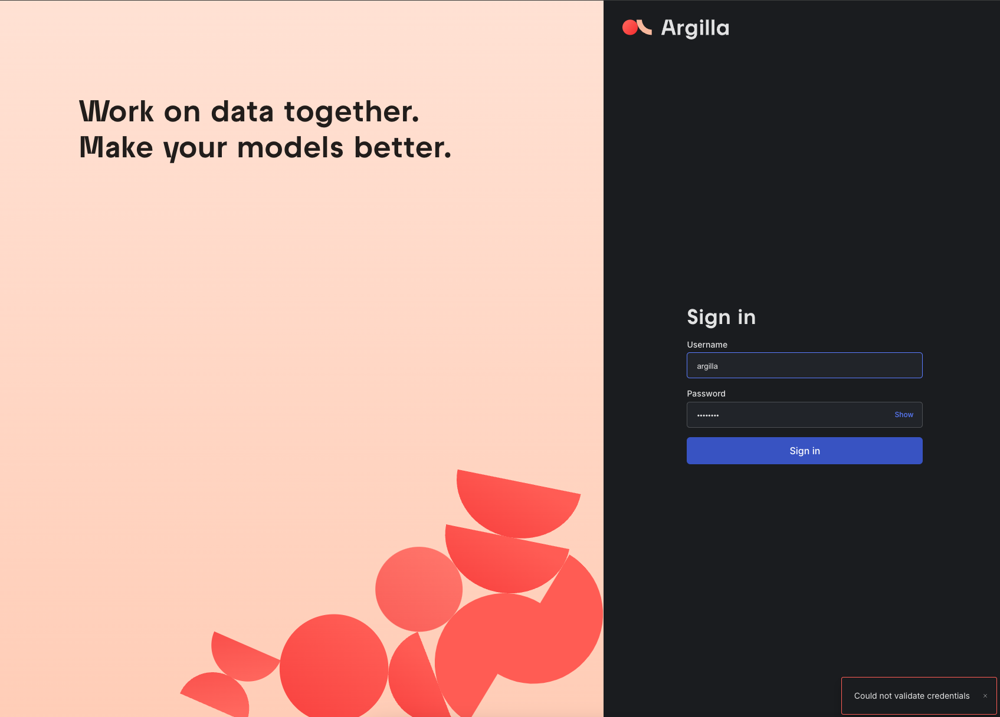

<!-- generated -->

# Argilla

1-Click installation template for Argilla on Easypanel

## Description

Argilla is a robust platform designed to help engineers and data scientists streamline the management of machine learning data workflows. It simplifies tasks like data labeling, annotation, and quality control, making it easier for businesses to build and maintain high-quality datasets for AI and machine learning projects. Argilla supports efficient collaboration, integrates seamlessly with popular ML frameworks, and provides a user-friendly interface for creating structured datasets. Its open-source nature ensures transparency, flexibility, and the ability to self-host for maximum control over your data and workflows.

## Benefits

- Streamlined Data Workflows: Argilla simplifies the management of machine learning data workflows, enabling teams to efficiently annotate, label, and maintain high-quality datasets. This helps accelerate AI and ML projects.
- Enhanced Collaboration: With Argilla, teams can collaborate seamlessly on dataset creation and management. It provides intuitive tools to ensure consistency and quality in data workflows.
- Integration with ML Frameworks: Argilla integrates effortlessly with popular machine learning frameworks and tools, allowing you to easily use your datasets in training and evaluation pipelines.

## Features

- Data Annotation and Labeling: Argilla offers advanced tools for annotating and labeling datasets with a user-friendly interface. These features ensure your datasets are accurate and ready for machine learning.
- Workflow Automation: Automate repetitive tasks in your data workflows to save time and focus on building intelligent systems. Argilla enables automated quality control and monitoring of datasets.
- Flexible Deployment: Argilla is open-source and can be self-hosted, providing flexibility and control over your data and infrastructure. Its design ensures privacy and security.
- Version Control for Datasets: Manage and track changes in your datasets with built-in version control, allowing you to maintain an organized history of dataset modifications.
- Secure and Private: Argilla prioritizes security and privacy, with features like self-hosting, encrypted connections, and full transparency in its open-source codebase.

## Links

- [Website](https://www.argilla.io/)
- [Documentation](https://docs.argilla.io/)
- [Github](https://github.com/argilla-io/argilla)
- [Template Source](https://github.com/easypanel-io/templates/tree/main/templates/argilla)

## Options

Name | Description | Required | Default Value
-|-|-|-
App Service Name | - | yes | argilla
App Service Image | - | yes | argilla/argilla-server:latest
Elasticsearch Service Image | - | yes | docker.elastic.co/elasticsearch/elasticsearch:8.12.2
Login User Name | - | yes | argilla
Login Password | This password should be 8 characters long | yes | password

## Screenshots

## Change Log

- 2024-12-21 – First Release

## Contributors

- [Ahson Shaikh](https://github.com/Ahson-Shaikh)
