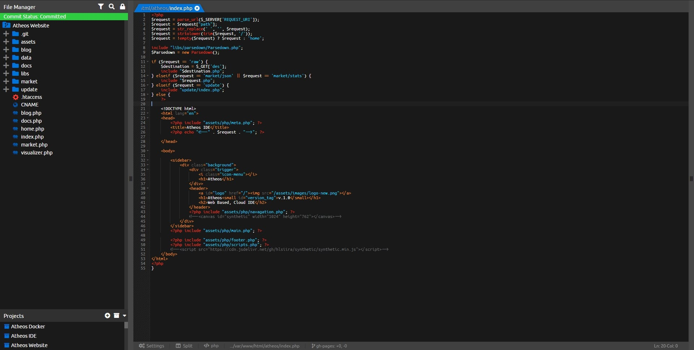

<!-- generated -->

# Atheos

1-Click installation template for Atheos on Easypanel

## Description

Atheos is a self-hosted browser-based cloud IDE, updated from Codiad IDE with a modern approach to web development. This lightweight development environment provides fast, interactive coding without the massive overhead of desktop editors. Atheos features built-in Git integration, a comprehensive plugin system, multi-user support with permissions, and supports multiple programming languages. Perfect for developers who want a complete IDE that runs entirely in the browser with minimal server requirements and maximum functionality.

## Benefits

- Browser-Based Development: Complete IDE running entirely in your browser - no desktop software installation required.
- Lightweight & Fast: Minimal server footprint with fast, interactive development experience without desktop editor overhead.
- Self-Hosted Control: Complete control over your development environment and code with self-hosted deployment.

## Features

- Modern Code Editor: Advanced code editing with syntax highlighting, code completion, and multiple language support.
- Built-in Git Integration: Seamless version control with integrated Git support for repository management.
- Plugin System: Extensible architecture with support for themes, plugins, and customizations.
- Multi-User Support: User permission system allowing multiple developers to work on projects with proper access control.
- File Management: Complete file system management with upload, download, and directory operations.
- Project Management: Organize and manage multiple projects with workspace functionality and project switching.

## Links

- [GitHub Repository](https://github.com/Atheos/Atheos)
- [Official Website](https://www.atheos.io)
- [Template Source](https://github.com/easypanel-io/templates/tree/main/templates/atheos)

## Options

Name | Description | Required | Default Value
-|-|-|-
App Service Name | - | yes | atheos
App Service Image | - | yes | hlsiira/atheos:latest

## Screenshots

## Change Log

- 2025-07-02 – Initial release

## Contributors

- [Ahson Shaikh](https://github.com/Ahson-Shaikh)
