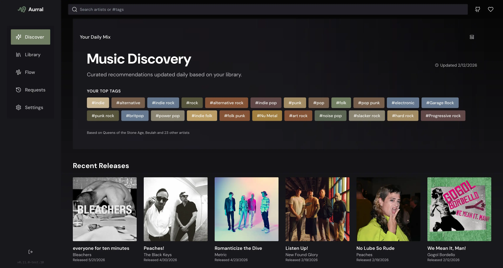

<!-- generated -->

# Aurral

1-Click installation template for Aurral on Easypanel

## Description

Aurral is a self-hosted music discovery and request management app for Lidarr. Search artists via MusicBrainz, add them to Lidarr with granular monitoring options, browse your library, and discover new artists from recommendations. Features include Weekly Flow playlists (powered by Soulseek + Navidrome), multi-user support with permissions, Gotify notifications, and PWA support. Aurral is designed to be safe for your collection—library changes go through Lidarr&#39;s API.

## Benefits

- Lidarr Integration: Add artists to Lidarr with granular monitor options. Track requests and download progress. Library changes go through Lidarr's API—safe for your main collection.
- Music Discovery: Daily Discover recommendations based on your library, tags, and trends. Deep artist pages with types, tags, release groups, and tracklists.
- Weekly Flow Playlists: Auto-curated playlists from your library. Built-in Soulseek client downloads tracks into a dedicated Weekly Flow library. Optional Navidrome integration.

## Features

- Artist Search: Real-time artist search via MusicBrainz. Add artists with monitor options (None, All, Future, Missing, Latest, First).
- Multi-User Support: First-run onboarding creates an admin account. Multiple local users with roles and granular permissions. Optional reverse-proxy auth.
- Gotify Notifications: Push notifications for key events like Discover updates and Weekly Flow completion.
- PWA Support: Installable web app with auto-update support. Web-based configuration.

## Links

- [GitHub](https://github.com/lklynet/aurral)
- [Container Registry](https://github.com/lklynet/aurral/pkgs/container/aurral)
- [Discord](https://discord.gg/cpPYfgVURJ)
- [Template Source](https://github.com/easypanel-io/templates/tree/main/templates/aurral)

## Options

Name | Description | Required | Default Value
-|-|-|-
App Service Name | - | yes | aurral
Aurral Image | - | yes | ghcr.io/lklynet/aurral:1.34.2

## Screenshots

## Change Log

- 2026-02-16 – Template Release (1.34.2)

## Contributors

- [Ahson Shaikh](https://github.com/Ahson-Shaikh)
