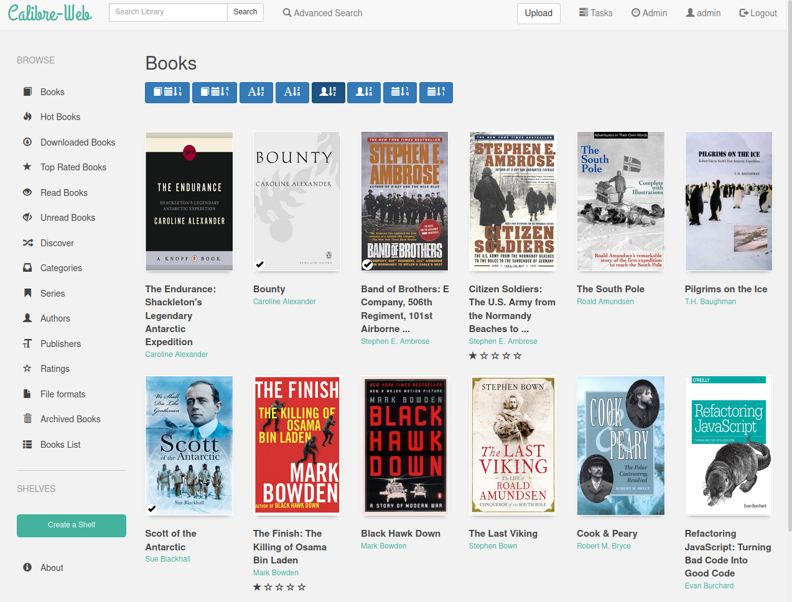

<!-- generated -->

# AutoCaliWeb

1-Click installation template for AutoCaliWeb on Easypanel

## Description

AutoCaliWeb is a self-hosted web application for browsing, reading, and managing your eBook, eComic, and PDF library through a clean, modern interface. Built on Calibre-Web with automated enhancements, it provides automatic book ingestion from a watch folder, multi-format conversion, metadata enforcement, and cover generation. Features include an in-browser reader for EPUB, PDF, and CBR formats, OPDS catalog for e-reader apps, Kobo and KOReader sync, Send-to-Kindle, multi-user management with fine-grained permissions, OAuth/OIDC authentication, automatic backups, and support for 20+ languages. It works with any existing Calibre database or creates one automatically.

## Benefits

- Automated Book Management: Drop books into the ingest folder and they are automatically imported, converted to multiple formats, enriched with metadata, and added to your Calibre library.
- Read Anywhere: Built-in browser reader supports EPUB, PDF, CBR, and more. OPDS catalog lets you browse and download from any compatible e-reader app.
- E-Reader Sync: Native sync with Kobo devices, KOReader, and Send-to-Kindle functionality keeps your reading progress and library in sync across all devices.

## Features

- Automatic Ingest & Conversion: Watch folder monitors for new books and automatically imports them with multi-format conversion, metadata fetching, and cover enforcement.
- Comprehensive User Management: Fine-grained per-user permissions, public registration support, LDAP, Google/GitHub OAuth, OIDC, and proxy authentication.
- Metadata Enrichment: Fetch metadata and covers from multiple sources including Goodreads, Hardcover, ISBNDB, Amazon JP, and LitRes. Automatically enrich newly added books.
- OPDS Catalog: Built-in OPDS feed at /opds lets any compatible e-reader app browse and download books from your library.
- Duplicate Management: Dedicated management system for identifying and handling duplicate books in your library.
- Self-Update & Backups: Built-in self-update capability, automated backup service, and server stats tracking keep your instance healthy and up to date.

## Links

- [Codeberg](https://codeberg.org/gelbphoenix/autocaliweb)
- [GitHub](https://github.com/gelbphoenix/autocaliweb)
- [Docker Hub](https://hub.docker.com/r/gelbphoenix/autocaliweb)
- [Wiki](https://codeberg.org/gelbphoenix/autocaliweb/wiki)
- [Template Source](https://github.com/easypanel-io/templates/tree/main/templates/autocaliweb)

## Options

Name | Description | Required | Default Value
-|-|-|-
App Service Name | - | yes | autocaliweb
AutoCaliWeb Image | - | yes | gelbphoenix/autocaliweb:v0.11.3
Timezone | Container timezone (e.g. America/New_York, Europe/Berlin, Asia/Karachi) | no | Etc/UTC

## Screenshots

## Change Log

- 2026-02-18 – Template Release (v0.11.3)

## Contributors

- [Ahson Shaikh](https://github.com/Ahson-Shaikh)
