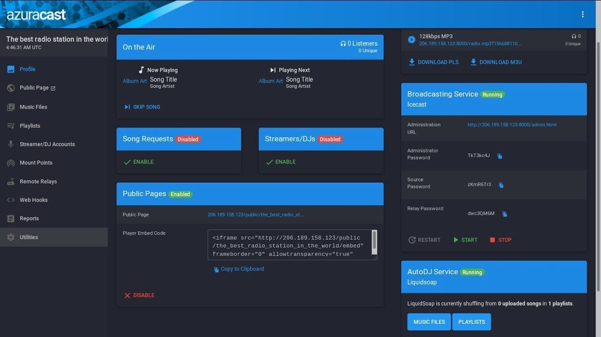

<!-- generated -->

# AzuraCast

1-Click installation template for AzuraCast on Easypanel

## Description

AzuraCast is a free, open-source web radio management suite. Built for radio station managers and DJs, it provides everything you need to start and manage a successful web radio station, from playlist automation to live streaming capabilities, listener statistics, and more.

## Benefits

- Complete Radio Management: Everything you need to run a web radio station in one comprehensive package.
- Web-Based Interface: Manage your station from anywhere with an intuitive web-based dashboard.
- Advanced Features: Includes playlist automation, live streaming, statistics, and more.

## Features

- Playlist Management: Create and manage playlists with smart rotation and scheduling.
- Live Streaming: Support for live DJs with seamless transitions between automated and live content.
- Statistics & Analytics: Detailed listener statistics and analytics to track your station's performance.
- Multi-Station Support: Host multiple radio stations from a single AzuraCast installation.

## Links

- [Documentation](https://docs.azuracast.com/)
- [Github](https://github.com/AzuraCast/AzuraCast)
- [Template Source](https://github.com/easypanel-io/templates/tree/main/templates/azuracast)

## Options

Name | Description | Required | Default Value
-|-|-|-
App Service Name | - | yes | azuracast
App Service Image | - | yes | ghcr.io/azuracast/azuracast:0.23.2
App Service Port | - | yes | 2022

## Screenshots

## Change Log

- 2025-06-11 – Template Release
- 2024-12-24 – Updated version to 0.23.2

## Contributors

- [Ahson Shaikh](https://github.com/Ahson-Shaikh)
