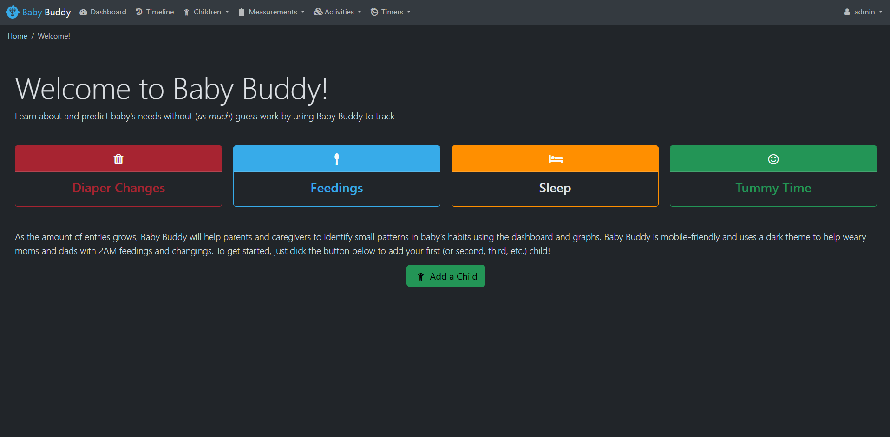

<!-- generated -->

# BabyBuddy

1-Click installation template for BabyBuddy on Easypanel

## Description

BabyBuddy is a comprehensive, user-friendly platform designed to help parents and caregivers manage essential details about their child’s growth and development. It provides tools for tracking feedings, sleep schedules, diaper changes, and milestones, making parenting a more organized and informed journey. With BabyBuddy, you can access detailed insights into your child&#39;s habits, progress, and overall well-being. The app offers customization options to fit individual family needs and supports data export for secure backup or sharing with healthcare professionals. BabyBuddy is lightweight, easy to deploy, and designed with a focus on privacy, ensuring your family’s data is safe and accessible only to you.

## Instructions

Login username=admin,password=admin

## Benefits

- Simplified Parenting: BabyBuddy helps you track essential information about your child’s daily activities and growth milestones with ease.
- Privacy and Security: BabyBuddy prioritizes data privacy, ensuring your child’s information is safe and accessible only to you.
- Customization Options: Tailor the app to suit your family’s unique needs with adjustable settings and features.
- Easy Deployment: BabyBuddy is lightweight, simple to deploy, and runs seamlessly on multiple platforms.

## Features

- Comprehensive Tracking Tools: Track feedings, sleep schedules, diaper changes, and more with detailed logs and insights.
- Growth Milestone Management: Record and monitor your child’s milestones, ensuring you stay updated on their development.
- Customizable Reports: Generate and export reports for secure backups or sharing with healthcare professionals.
- Multi-User Support: Allow multiple caregivers to contribute to and access the child’s data, making it easier to collaborate.

## Links

- [Website](https://babybuddy.app)
- [Documentation](https://docs.babybuddy.app)
- [GitHub](https://github.com/babybuddy/babybuddy)
- [Template Source](https://github.com/easypanel-io/templates/tree/main/templates/babybuddy)

## Options

Name | Description | Required | Default Value
-|-|-|-
App Service Name | - | yes | babybuddy
App Service Image | - | yes | linuxserver/babybuddy:2.7.0

## Screenshots

## Change Log

- 2024-11-16 – First release
- 2025-01-06 – Version bumped to 2.7.0

## Contributors

- [Ahson Shaikh](https://github.com/Ahson-Shaikh)
