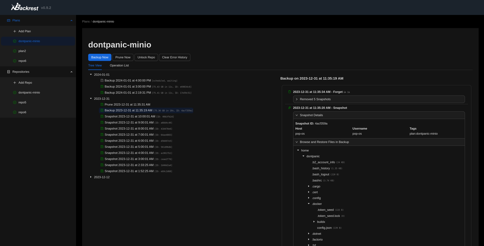

<!-- generated -->

# Backrest

1-Click installation template for Backrest on Easypanel

## Description

Backrest is a web UI and orchestrator for restic backups. It supports scheduling, browsing snapshots, restores, notifications, and any restic-backed storage (S3, B2, rclone remotes, local, etc.). This template keeps the standard data/config/cache/tmp/rclone volumes and optionally bind-mounts host paths at /userdata and /repos like the upstream Docker Compose examples.

## Instructions

Backup sources; Use template fields Host path → /userdata and/or Host path → /repos for directories you want visible inside the container (same as path/to/backup/data:/userdata and path/to/local/repos:/repos in the official compose). You can also add more bind mounts in Easypanel for other paths, then reference them in backup plans inside Backrest. First run; Open the UI, complete setup (credentials), and configure repos and schedules per the documentation.

## Benefits

- Reliable Backup Solution: Provides robust backup and restore capabilities with support for multiple storage backends and comprehensive data protection strategies.
- Multiple Storage Options: Supports local storage, cloud providers, and rclone-compatible services for flexible backup destination options.
- Web-Based Management: Clean and intuitive web interface for managing backups, scheduling, and monitoring backup status and health.
- Self-Hosted Control: Complete control over your backup data with no external dependencies or data sharing with third parties.

## Features

- Web Interface: Modern web-based interface accessible from any device with a browser for easy backup management.
- Multiple Storage Backends: Support for various storage options including local filesystem, cloud providers, and rclone-compatible services.
- Backup Scheduling: Flexible scheduling options for automated backups with customizable intervals and retention policies.
- Data Encryption: Built-in encryption capabilities to secure your backup data both in transit and at rest.
- Backup Monitoring: Comprehensive monitoring and reporting of backup status, health, and performance metrics.
- Restore Capabilities: Easy restore functionality with point-in-time recovery options and selective file restoration.
- Configuration Management: Centralized configuration management with JSON-based settings and environment variable support.
- Cache Management: Efficient caching system for improved performance and reduced storage overhead during backup operations.

## Links

- [Website](https://garethgeorge.github.io/backrest/)
- [Documentation](https://garethgeorge.github.io/backrest/introduction/getting-started)
- [GitHub](https://github.com/garethgeorge/backrest)
- [Docker Hub](https://hub.docker.com/r/garethgeorge/backrest)
- [Template Source](https://github.com/easypanel-io/templates/tree/main/templates/backrest)

## Options

Name | Description | Required | Default Value
-|-|-|-
App Service Name | - | yes | backrest
App Service Image | - | yes | ghcr.io/garethgeorge/backrest:v1.12.1
Timezone | Container TZ (e.g. America/New_York, Europe/Berlin). | yes | Etc/UTC
Host path mounted at /userdata (optional) | Absolute host path to files or folders you want Backrest to back up, mounted read/write at /userdata inside the container. Leave empty to skip. | no | 
Host path mounted at /repos (optional) | Absolute host path for local restic repos, mounted at /repos. Leave empty to skip. | no | 

## Screenshots

## Change Log

- 2025-09-29 – First release
- 2026-03-20 – Website/docs links, optional /userdata & /repos, TZ default Etc/UTC

## Contributors

- [Ahson Shaikh](https://github.com/Ahson-Shaikh)
