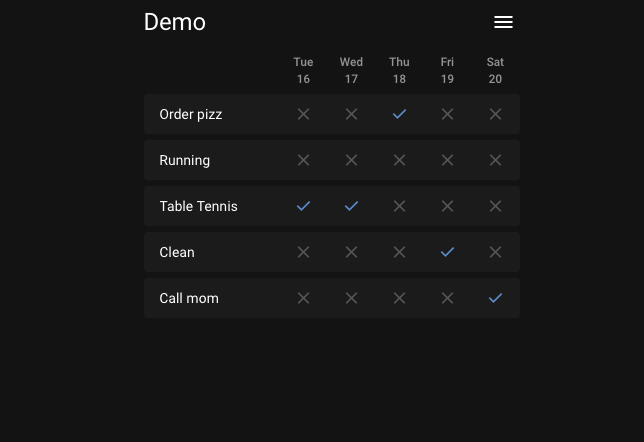

<!-- generated -->

# BeaverHabits

1-Click installation template for BeaverHabits on Easypanel

## Description

BeaverHabits is a self-hosted habit tracking application that helps you build and maintain positive habits through a simple, intuitive web interface. It provides visual tracking of your daily habits, customizable date columns, and supports both database and file-based storage options for flexibility in deployment and data management.

## Benefits

- Simple Habit Tracking: Clean and intuitive interface for tracking daily habits with visual progress indicators and easy-to-use controls for habit management.
- Flexible Storage Options: Choose between SQLite database or JSON file storage to match your deployment preferences and data management needs.
- Self-Hosted Privacy: Keep your habit data completely private and secure on your own server with no external dependencies or data sharing.

## Features

- Visual Habit Tracking: Track your daily habits with visual indicators and progress tracking to help you stay motivated and consistent with your goals.
- Customizable Interface: Customize the number of date columns displayed on the index page to match your preferred viewing style and workflow.
- Authentication Options: Skip authentication for trusted local users or implement full authentication system based on your security requirements.
- iOS Standalone Support: Enhanced mobile experience with iOS standalone app mode for seamless habit tracking on mobile devices.
- Data Persistence: Reliable data storage with options for both database and file-based storage to ensure your habit data is always preserved.
- Easy Deployment: Simple Docker-based deployment with minimal configuration required to get your personal habit tracking server running quickly.

## Links

- [Demo](https://beaverhabits.com/demo)
- [Documentation](https://github.com/daya0576/beaverhabits/wiki)
- [Github](https://github.com/daya0576/beaverhabits)
- [Template Source](https://github.com/easypanel-io/templates/tree/main/templates/beaverhabits)

## Options

Name | Description | Required | Default Value
-|-|-|-
App Service Name | - | yes | beaverhabits
App Service Image | - | yes | daya0576/beaverhabits:0.7.0
Trusted Local Email | Email address to skip authentication (leave empty to disable) | no | your@email.com

## Screenshots

## Change Log

- 2025-09-12 – Template Release (v0.7.0)

## Contributors

- [Ahson Shaikh](https://github.com/Ahson-Shaikh)
