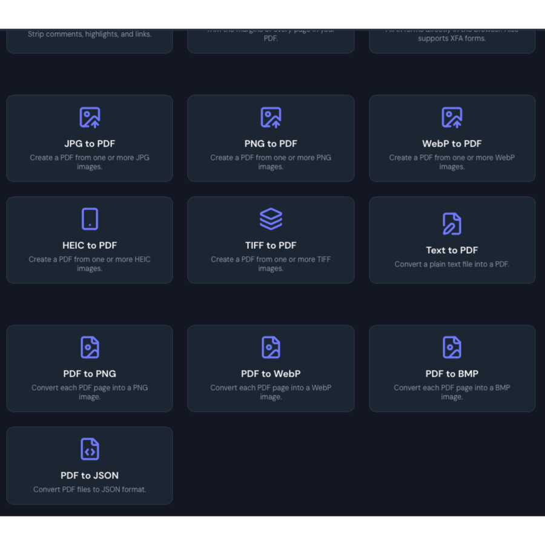

<!-- generated -->

# BentoPDF

1-Click installation template for BentoPDF on Easypanel

## Description

BentoPDF is a powerful self-hosted PDF manipulation and conversion service that provides a comprehensive API for working with PDF documents. It enables developers and teams to automate PDF operations including conversion, merging, splitting, compression, watermarking, and more through a simple REST API. Built with modern technologies, BentoPDF offers a web interface for manual operations and programmatic access for integration into your applications and workflows. The service supports converting various document formats to PDF, extracting text and images, adding annotations, and manipulating PDF metadata. With no external dependencies on third-party services, BentoPDF ensures your documents remain private and secure on your own infrastructure. Perfect for document management systems, automated report generation, form processing, digital archiving, and any application that requires reliable PDF handling capabilities without the costs and privacy concerns of cloud-based PDF services.

## Benefits

- Self-Hosted PDF Processing: Process PDFs on your own infrastructure without sending sensitive documents to external services, maintaining complete privacy and control.
- Comprehensive REST API: Easy-to-use API enables seamless integration with existing applications and automated workflows for PDF operations.
- No External Dependencies: Fully contained service with all PDF processing capabilities built-in, eliminating reliance on third-party services and reducing costs.

## Features

- PDF Conversion: Convert various document formats including Word, Excel, PowerPoint, images, and HTML to high-quality PDF documents.
- PDF Manipulation: Merge multiple PDFs, split documents into pages, extract specific pages, and reorganize page order programmatically.
- Compression and Optimization: Reduce PDF file sizes while maintaining quality, optimize for web delivery, and compress images within documents.
- Watermarking and Annotations: Add text or image watermarks, insert annotations, stamps, and custom metadata to protect and identify documents.
- Text and Image Extraction: Extract text content for indexing and search, pull images from PDFs, and parse document structure and metadata.
- Web Interface: User-friendly web UI for manual PDF operations and testing API capabilities without writing code.

## Links

- [Website](https://bentopdf.com)
- [GitHub](https://github.com/alam00000/bentopdf)
- [Template Source](https://github.com/easypanel-io/templates/tree/main/templates/bentopdf)

## Options

Name | Description | Required | Default Value
-|-|-|-
App Service Name | - | yes | bentopdf
App Service Image | - | yes | bentopdfteam/bentopdf:sha-fb8c8c0

## Screenshots

## Change Log

- 2025-11-24 – Template Release
- 2026-03-25 – Added missing GitHub source link
- 2026-05-06 – Version bumped to sha-fb8c8c0

## Contributors

- [Ahson Shaikh](https://github.com/Ahson-Shaikh)
