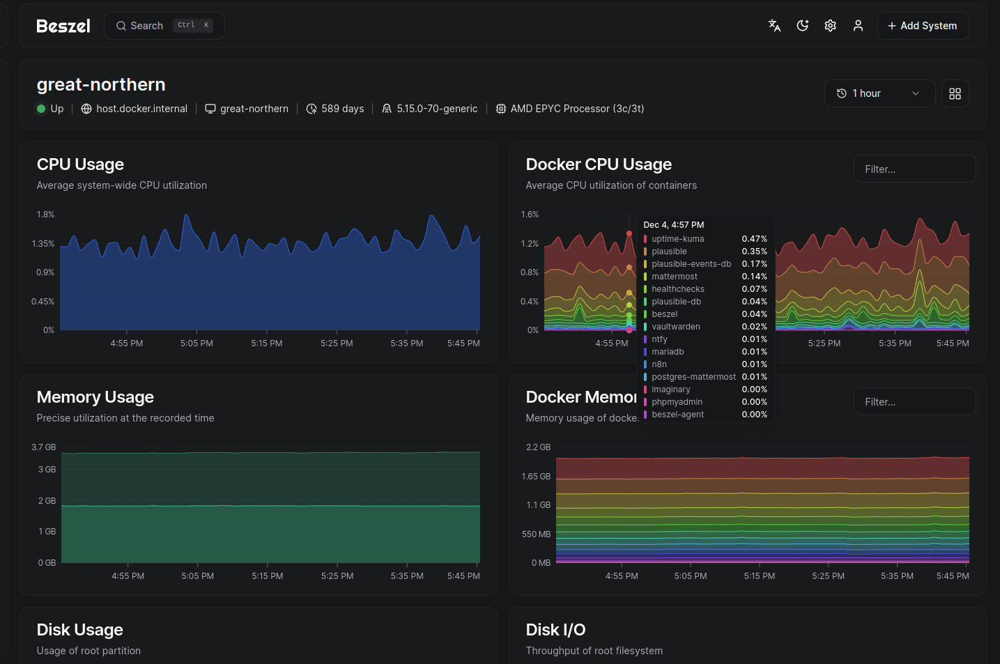
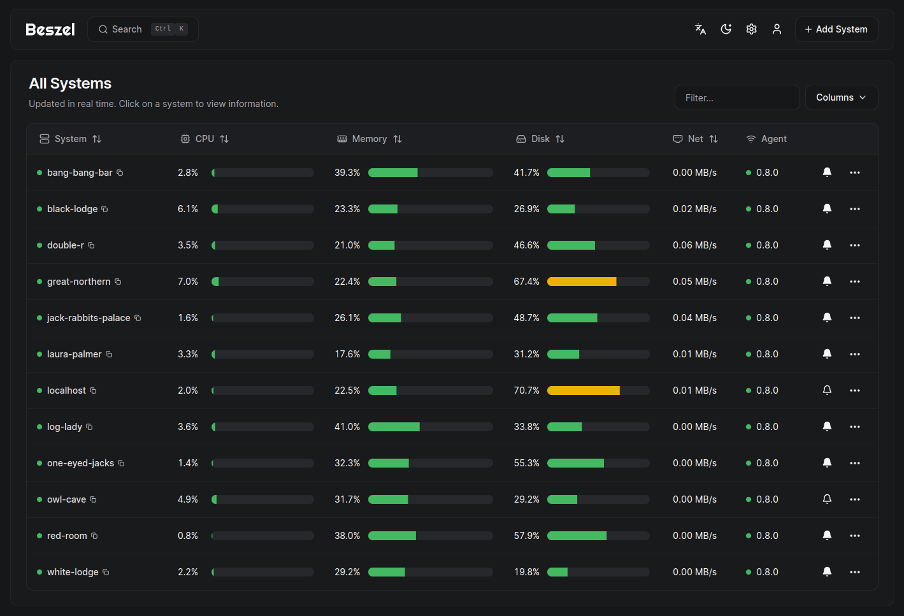
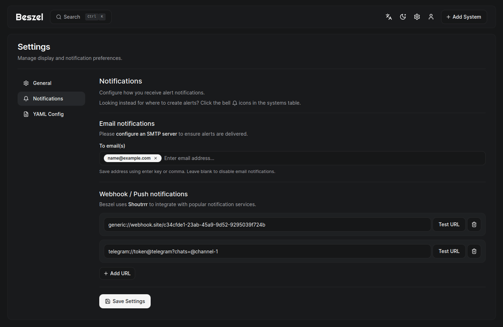

<!-- generated -->

# Beszel

1-Click installation template for Beszel on Easypanel

## Description

Beszel is a lightweight server monitoring platform that includes Docker statistics, historical data, and alert functions. It has a friendly web interface, simple configuration, and is ready to use out of the box. It supports automatic backup, multi-user, OAuth authentication, and API access.

## Benefits

- Comprehensive Monitoring: Monitor server performance, Docker statistics, and historical data seamlessly.
- Ready-to-Use: Simple setup with minimal configuration required, making it operational out of the box.
- Secure and Flexible: Benefit from multi-user management, OAuth authentication, and automatic backups.

## Features

- Docker Statistics: Gain insights into your Docker containers’ performance and resource usage.
- Historical Data: View and analyze past server performance trends for better decision-making.
- Alert Functions: Receive real-time alerts for critical server events and thresholds.
- API and OAuth Support: Access Beszel’s functionalities programmatically via API and secure user authentication through OAuth.

## Links

- [Documentation](https://github.com/henrygd/beszel/blob/main/readme.md)
- [Github](https://github.com/henrygd/beszel)
- [Template Source](https://github.com/easypanel-io/templates/tree/main/templates/beszel)

## Options

Name | Description | Required | Default Value
-|-|-|-
App Service Name | - | yes | beszel
App Service Image | - | yes | henrygd/beszel:0.9.1

## Screenshots

## Change Log

- 2025-01-10 – Template Release

## Contributors

- [Ahson Shaikh](https://github.com/Ahson-Shaikh)
