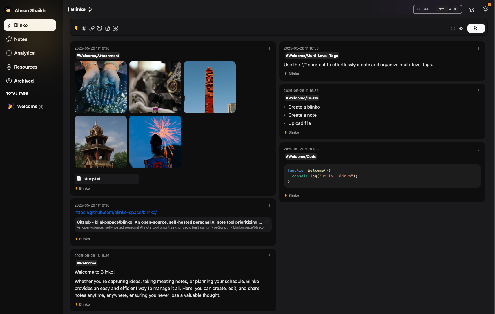

<!-- generated -->

# Blinko

1-Click installation template for Blinko on Easypanel

## Description

Blinko (space) is an open-source, self-hosted “idea hub” that rolls notes, micro-blog posts, paste-bins and lightweight tasks into one minimalist, card-style interface. You jot down thoughts in plain text or Markdown; behind the scenes Blinko indexes every word with an AI-powered RAG engine (works with OpenAI or a local Ollama model), so you can later retrieve anything with natural-language search instead of keywords

## Benefits

- Collaborative Space: Create and manage shared workspaces for team collaboration.
- Real-time Updates: See changes and updates from team members instantly.
- Secure Environment: Enterprise-grade security for your team's sensitive data.
- Customizable Workflows: Adapt the workspace to match your team's unique processes.

## Features

- Shared Workspaces: Create multiple workspaces for different teams and projects.
- Document Management: Store, organize and version control all your team documents.
- Team Chat & Messaging: Built-in communication tools for seamless team coordination.
- Task Management: Track and manage team tasks and project progress.
- Access Controls: Granular permissions to control who can access what.
- Activity Tracking: Monitor workspace activity and team member contributions.

## Links

- [Website](https://blinko.space/)
- [Documentation](https://docs.blinko.space/)
- [Github](https://github.com/blinkospace/blinko)
- [Template Source](https://github.com/easypanel-io/templates/tree/main/templates/blinko)

## Options

Name | Description | Required | Default Value
-|-|-|-
Service Name | - | yes | blinko
App Service Image | - | yes | blinkospace/blinko:1.1.2

## Screenshots

## Change Log

- 2025-05-26 – First release
- 2025-07-15 – Version bumped to 1.1.2

## Contributors

- [Ahson Shaikh](https://github.com/Ahson-Shaikh)
