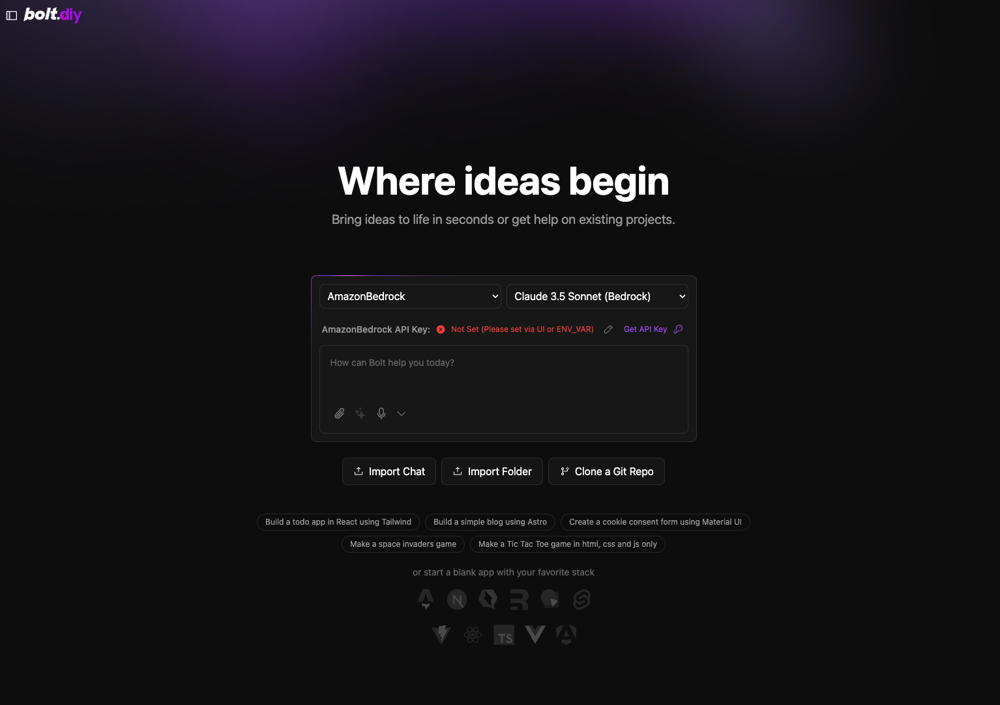

<!-- generated -->

# Bolt.Diy

1-Click installation template for Bolt.Diy on Easypanel

## Description

Bolt.Diy is an AI-powered agent and community for web development, enabling you to create, edit, and deploy full-stack applications without any local setup. It&#39;s like having a coding genie at your fingertips, transforming your web ideas into reality with just a few prompts. Bolt.Diy streamlines the development process with intelligent suggestions, automated workflows, and seamless deployment, making it the ultimate tool for modern web developers. The app is fully containerized and designed for accessibility across various platforms.

## Benefits

- AI-Powered Development: Bolt.Diy leverages AI to assist with code generation, debugging, and deployment, dramatically reducing the time needed to build web applications.
- No Local Setup Required: Create and deploy full-stack applications directly in the browser or through cloud-hosted environments without the need for local installations or configurations.
- Real-Time Collaboration: Work with your team in real-time, sharing ideas and edits seamlessly through an integrated collaboration platform.

## Features

- Intelligent Code Assistance: Bolt.Diy provides smart suggestions and automates repetitive coding tasks to speed up the development process.
- Full-Stack Capabilities: Build and deploy both front-end and back-end applications using Bolt.Diy's comprehensive tools and frameworks.
- Community-Driven Platform: Engage with a vibrant developer community, sharing tips, resources, and best practices to enhance your projects.
- Integrated Deployment: Deploy applications directly from the platform to your hosting environment without leaving the interface, ensuring a smooth and efficient workflow.

## Links

- [Github](https://github.com/stackblitz-labs/bolt.diy)
- [Template Source](https://github.com/easypanel-io/templates/tree/main/templates/boltdiy)

## Options

Name | Description | Required | Default Value
-|-|-|-
App Service Name | - | yes | boltdiy

## Screenshots

## Change Log

- 2025-01-28 – First Release

## Contributors

- [Ahson Shaikh](https://github.com/Ahson-Shaikh)
