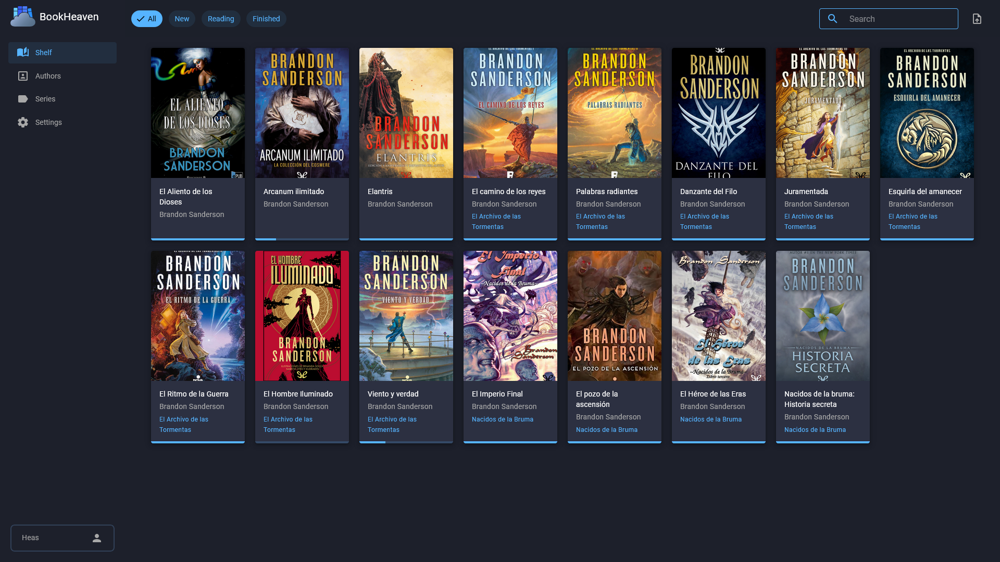

<!-- generated -->

# BookHeaven

1-Click installation template for BookHeaven on Easypanel

## Description

BookHeaven Server is a self-hosted ebook library manager that lets you organize, read, and manage your ebook collection with a modern responsive UI. It reads metadata directly from ebook files (title, author, cover), allows editing and persists changes back into the file. Features include auto-discovery by the companion Android e-ink reader app, metadata fetching from the internet, reading progress tracking, font management for your devices, multiple profiles, OPDS support, and book importing via a dedicated folder. Built with .NET and Blazor.

## Benefits

- Simple & Lightweight: Single container deployment with no database required. All data (books, covers, fonts, metadata) is stored in a single persistent data directory.
- Modern Responsive UI: Clean, modern web interface built with Blazor and MudBlazor that works on desktop and mobile browsers.
- E-Ink Reader Companion: Companion Android app (BookHeaven Reader) for e-ink devices with auto-discovery, font downloads, and reading progress sync.

## Features

- Metadata Management: Reads metadata from ebook files automatically. Edit titles, authors, covers, and more—changes are persisted back into the file.
- Internet Metadata Fetching: Fetch covers and metadata from the internet to enrich your library without manual editing.
- Reading Progress Tracking: Track start date, last read date, percentage, elapsed time, and finished date. Set progress manually or sync from the reader app.
- OPDS Support: Built-in OPDS endpoint at /opds for browsing and downloading books with any compatible e-reader app.
- Font Management: Upload and manage fonts so your e-ink devices can easily download and use them. Supports multiple styles and weights.
- Multiple Profiles: Create separate profiles to keep reading progress independent across different users or devices.

## Links

- [GitHub](https://github.com/BookHeaven/BookHeaven.Server)
- [Website](https://bookheaven.ggarrido.dev)
- [Documentation](https://bookheaven.ggarrido.dev/getting-started)
- [Template Source](https://github.com/easypanel-io/templates/tree/main/templates/bookheaven)

## Options

Name | Description | Required | Default Value
-|-|-|-
App Service Name | - | yes | bookheaven
BookHeaven Image | - | yes | ghcr.io/bookheaven/bookheaven-server:0.15.0
Timezone | Container timezone (e.g. America/New_York, Europe/Madrid, Asia/Karachi) | no | UTC

## Screenshots

## Change Log

- 2026-02-18 – Template Release (v0.15.0)

## Contributors

- [Ahson Shaikh](https://github.com/Ahson-Shaikh)
