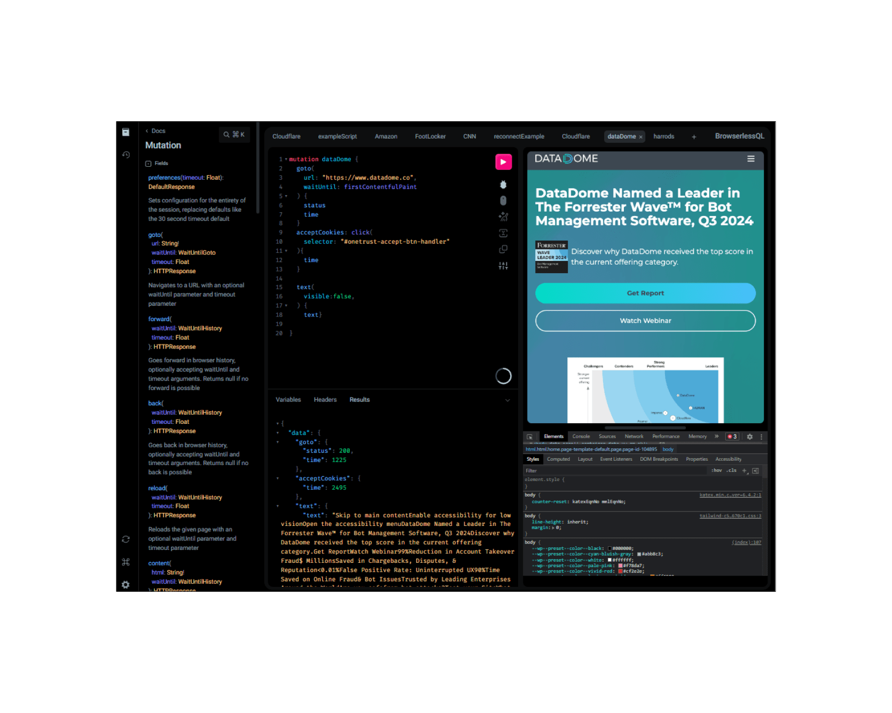

<!-- generated -->

# Browserless

1-Click installation template for Browserless on Easypanel

## Description

Browserless is a powerful self-hosted headless browser service designed to automate web interactions. It enables developers to run headless Chrome instances efficiently for web scraping, testing, PDF generation, and automation tasks. Browserless supports Puppeteer, Playwright, and Selenium, providing a scalable and secure environment for handling complex browser automation tasks. The application is optimized for performance, offering session management, request queuing, and robust security features. With Browserless, developers can offload browser-based automation to a dedicated service, reducing local resource consumption and improving workflow efficiency.

## Instructions

Update your App to use Browserless. Follow the docs; https://docs.browserless.io/baas/docker/quickstart.

## Benefits

- Scalable Browser Automation: Browserless enables developers to run headless Chrome instances for automation, testing, and data extraction without maintaining local infrastructure.
- Supports Multiple Frameworks: Compatible with Puppeteer, Playwright, and Selenium, making it versatile for different automation needs.
- Optimized Performance: Designed for efficiency, with session management, request queuing, and resource monitoring to ensure smooth execution of browser tasks.

## Features

- Headless Browser API: Provides a REST API to interact with headless Chrome for automation and testing.
- Web Scraping: Perform data extraction from websites with ease using Puppeteer and Playwright integrations.
- Screenshot & PDF Generation: Capture screenshots and generate PDFs from web pages for reporting and archival purposes.
- Session Management: Manage multiple concurrent sessions efficiently to optimize resource usage and speed.
- Secure Execution: Includes authentication, IP whitelisting, and rate limiting to prevent abuse and ensure security.
- Cloud & On-Prem Support: Deploy in the cloud or self-host on your own infrastructure for full control over automation tasks.
- Request Queuing: Handles a large number of automation requests efficiently with an intelligent queuing system.

## Links

- [Documentation](https://docs.browserless.io/)
- [Github](https://github.com/browserless/chrome)
- [Template Source](https://github.com/easypanel-io/templates/tree/main/templates/browserless)

## Options

Name | Description | Required | Default Value
-|-|-|-
App Service Name | - | yes | browserless
App Service Image | - | yes | ghcr.io/browserless/chromium
Concurrent Sessions | - | yes | 10

## Screenshots

## Change Log

- 2025-01-29 – First Release

## Contributors

- [Ahson Shaikh](https://github.com/Ahson-Shaikh)
