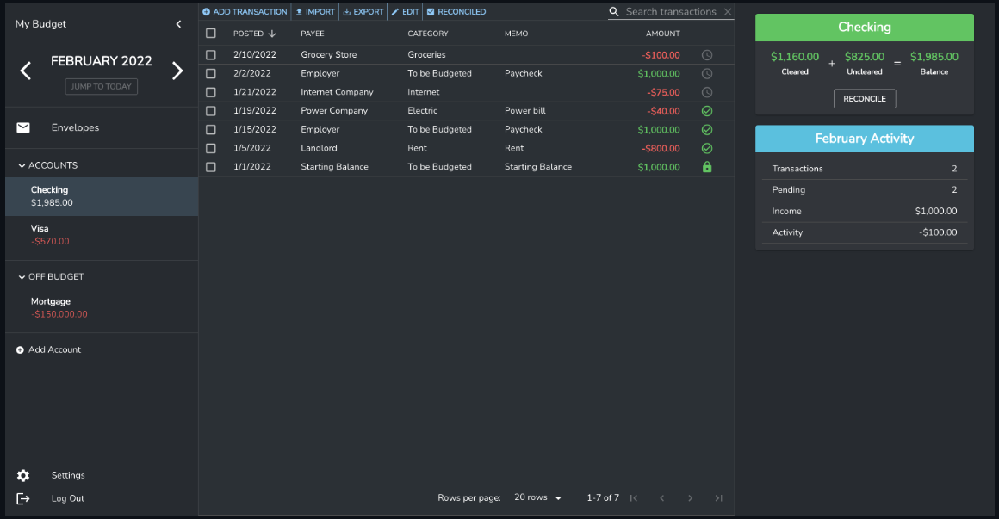

<!-- generated -->

# Budge

1-Click installation template for Budge on Easypanel

## Description

Budge is a personal finance management application that helps you track your expenses, manage budgets, and monitor your financial goals. It provides a user-friendly interface for managing your personal finances.

## Benefits

- Personal Finance Management: Budge provides a comprehensive solution for managing your personal finances with an intuitive interface.
- Budget Tracking: Track your expenses and manage budgets to achieve your financial goals.
- User-Friendly: Simple and intuitive interface makes it easy to manage your finances.

## Features

- Expense Tracking: Track your daily expenses and categorize them for better organization.
- Budget Management: Create and manage budgets for different categories and time periods.
- Financial Goals: Set and track your financial goals with progress monitoring.
- Reports and Analytics: Generate reports and analyze your spending patterns.
- Multi-Currency Support: Support for multiple currencies for international users.
- Containerized: Easy to deploy and manage in containerized environments.

## Links

- [Github](https://github.com/linuxserver/budge)
- [Documentation](https://github.com/linuxserver/budge#readme)
- [Template Source](https://github.com/easypanel-io/templates/tree/main/templates/budge)

## Options

Name | Description | Required | Default Value
-|-|-|-
App Service Name | - | yes | budge
App Service Image | - | yes | lscr.io/linuxserver/budge:0.0.9

## Screenshots

## Change Log

- 2025-04-29 – First Release

## Contributors

- [Ahson Shaikh](https://github.com/Ahson-Shaikh)
