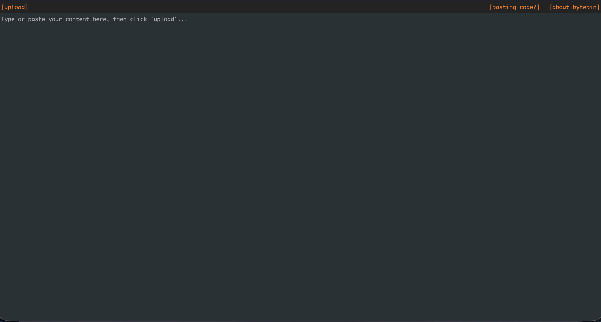

<!-- generated -->

# Bytebin

1-Click installation template for Bytebin on Easypanel

## Description

Bytebin is a fast, lightweight, and simple pastebin service for sharing text and code snippets. Built with performance in mind, it provides an easy way to store and share content through unique URLs. Bytebin is designed to be minimalistic and efficient, making it perfect for developers who need a straightforward solution for sharing code, logs, or text data with automatic expiration and configurable storage limits.

## Instructions

Bytebin exposes a simple HTTP API on port 8080. After deployment, open GET /health for a quick health check, POST /post with your content in the request body to create a paste. Data is persisted in /opt/bytebin/content and /opt/bytebin/db, so existing keys survive restarts and upgrades. Adjust BYTEBIN_MISC_KEYLENGTH and BYTEBIN_CONTENT_MAXSIZE if you need longer keys or larger payload limits.

## Benefits

- Fast & Lightweight: Minimal resource footprint with high performance for quick content sharing and retrieval.
- Simple to Use: Straightforward API and interface for posting and retrieving content with unique URLs.
- Automatic Expiration: Content automatically expires after a certain period, keeping storage clean and efficient.
- Configurable Limits: Customize key length and maximum content size to suit your specific needs and security requirements.

## Features

- Pastebin Service: Share text, code snippets, and logs easily through unique URLs with automatic content management.
- RESTful API: Simple REST API for posting content and retrieving it using unique keys for integration with other tools.
- Content Storage: Persistent storage with configurable limits and automatic cleanup of expired content.
- Customizable Settings: Configure key length and maximum content size through environment variables for your use case.

## Links

- [GitHub](https://github.com/lucko/bytebin)
- [Documentation](https://github.com/lucko/bytebin#readme)
- [Template Source](https://github.com/easypanel-io/templates/tree/main/templates/bytebin)

## Options

Name | Description | Required | Default Value
-|-|-|-
App Service Name | - | yes | bytebin
App Service Image | - | yes | ghcr.io/lucko/bytebin:latest
Key Length | - | no | 15
Max Content Size (MB) | - | no | 5

## Screenshots

## Change Log

- 2025-10-13 – Initial Template Release

## Contributors

- [Ahson Shaikh](https://github.com/Ahson-Shaikh)
