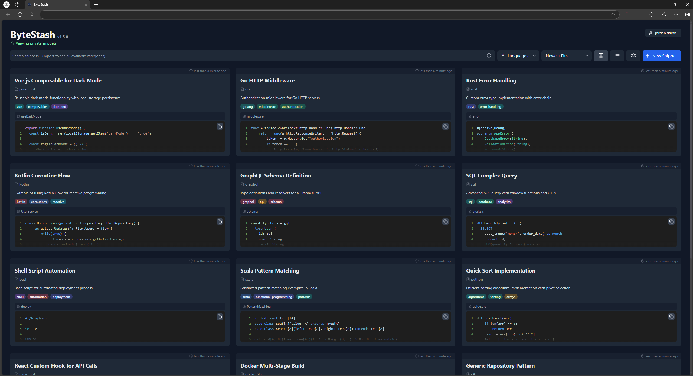

<!-- generated -->

# ByteStash

1-Click installation template for ByteStash on Easypanel

## Description

ByteStash is a self-hosted snippet code storage system designed for developers and teams. It provides a secure, organized platform to store, manage, and share your code snippets. With support for multiple programming languages, syntax highlighting, tagging, and a robust search functionality, ByteStash streamlines code reuse and collaboration. The intuitive interface and powerful features ensure that your code is always at your fingertips, whether you&#39;re working solo or with a team.

## Benefits

- Centralized Code Management: ByteStash provides a single, secure location to store all your code snippets, making it easy to manage and access your code whenever you need it.
- Enhanced Productivity: With features like tagging, robust search functionality, and syntax highlighting, ByteStash helps you quickly locate and reuse code, streamlining your development workflow.
- Collaboration and Sharing: Easily share your snippets with teammates or the developer community, and collaborate in real-time or asynchronously to improve code quality and foster innovation.

## Features

- Syntax Highlighting: Supports multiple programming languages with customizable syntax highlighting to ensure your code is easy to read and understand.
- Tagging and Organization: Organize your snippets with tags and categories, making it simple to sort and find code quickly.
- Secure Access: Implement user authentication and access controls to keep your code private and secure.
- Powerful Search: Utilize advanced search features to quickly locate snippets by keywords, tags, or language.
- RESTful API: Integrate ByteStash with other tools and services through a comprehensive and easy-to-use API.

## Links

- [Documentation](https://github.com/jordan-dalby/bytestash/wiki)
- [Github](https://github.com/jordan-dalby/bytestash)
- [Template Source](https://github.com/easypanel-io/templates/tree/main/templates/bytestash)

## Options

Name | Description | Required | Default Value
-|-|-|-
Service Name | - | yes | bytestash
Service Image | - | yes | ghcr.io/jordan-dalby/bytestash:1.5.6

## Screenshots

## Change Log

- 2025-02-10 – First Release

## Contributors

- [Ahson Shaikh](https://github.com/Ahson-Shaikh)
