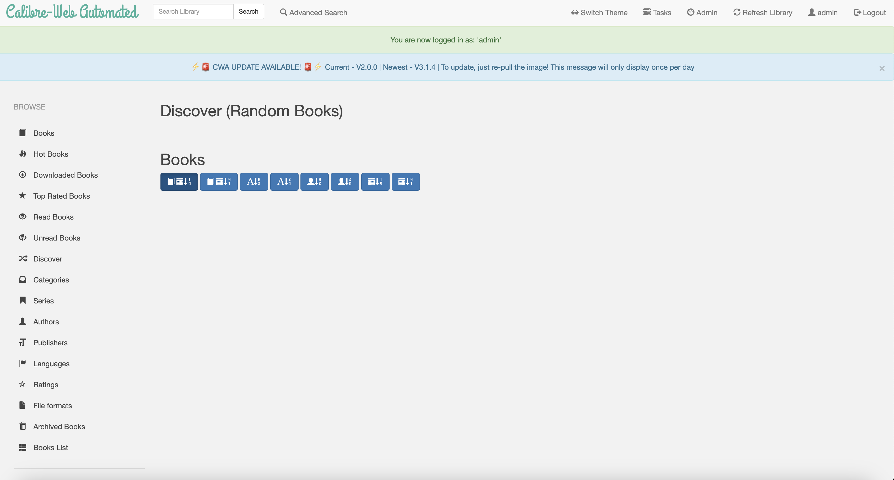

<!-- generated -->

# Calibre Web Automated

1-Click installation template for Calibre Web Automated on Easypanel

## Description

Calibre Web Automated (CWA) is an enhanced version of Calibre Web with automated book processing capabilities. It automatically adds books to your library from an ingest directory, supports Hardcover API integration for enhanced metadata, and provides network share compatibility. CWA processes books according to your configured settings and removes them from the ingest directory after processing, making it perfect for automated eBook management workflows.

## Instructions

Default login credentials are admin/admin123

## Benefits

- Automated Book Processing: Automatically process and add books to your library from an ingest directory, removing the need for manual book management and organization.
- Enhanced Metadata Integration: Integrate with Hardcover API for richer book metadata, covers, and information to keep your library well-organized and informative.
- Network Share Compatibility: Optimized for network storage solutions like NFS and SMB shares with reduced locking issues and improved performance on network-attached storage.

## Features

- Automated Ingest Processing: Drop books into the ingest directory and CWA will automatically process them according to your configured settings, then remove them after processing.
- Hardcover API Integration: Enhanced metadata retrieval using Hardcover API for better book information, covers, and categorization.
- Plugin Support: Support for Calibre plugins to extend functionality and customize your book processing workflow (experimental feature).
- Network Storage Optimization: Special optimizations for network-attached storage to prevent locking issues and improve performance on shared drives.
- Flexible Port Configuration: Customizable web server port to avoid conflicts with other services running on your system.
- Automatic Library Creation: If you don't have an existing library, CWA will automatically create one at the specified location with proper configuration.

## Links

- [Docker Hub](https://hub.docker.com/r/crocodilestick/calibre-web-automated)
- [Github](https://github.com/crocodilestick/calibre-web-automated)
- [Template Source](https://github.com/easypanel-io/templates/tree/main/templates/calibre-web-automated)

## Options

Name | Description | Required | Default Value
-|-|-|-
App Service Name | - | yes | calibre-web-automated
App Service Image | - | yes | crocodilestick/calibre-web-automated:v2.0.0
Timezone | Timezone for the application | no | UTC
Hardcover API Token | Hardcover API key for enhanced metadata (get one at https://docs.hardcover.app/api/getting-started/) | no | 
Network Share Mode | Enable if your library is on a network share (NFS/SMB) to reduce locking issues | no | false
Enable Calibre Plugins | Enable support for Calibre plugins (experimental) | no | false

## Screenshots

## Change Log

- 2025-09-12 – Template Release

## Contributors

- [Ahson Shaikh](https://github.com/Ahson-Shaikh)
