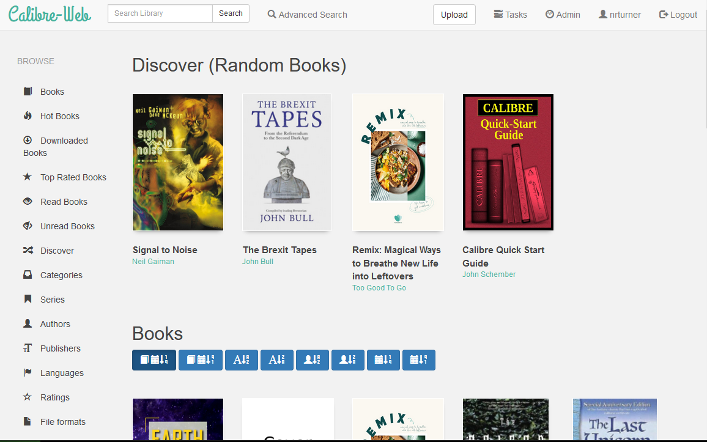

<!-- generated -->

# Calibre Web

1-Click installation template for Calibre Web on Easypanel

## Description

Calibre Web is a web app providing a clean interface for browsing, reading and downloading eBooks using an existing Calibre database. It is a Python web application that provides a web interface for the Calibre eBook library. It supports multiple users, user management, and provides a modern, responsive interface for accessing your eBook collection from any device.

## Instructions

Default login credentials are admin/admin123

## Benefits

- Web-Based eBook Management: Access your entire Calibre eBook library through a modern, responsive web interface from any device without needing the Calibre desktop application.
- Multi-User Support: Share your eBook collection with family and friends through user management features with different permission levels and access controls.
- Cross-Platform Access: Read and manage your eBooks from any device with a web browser, including smartphones, tablets, and computers.

## Features

- eBook Library Browser: Browse your entire eBook collection with advanced filtering, searching, and categorization options to quickly find the books you want to read.
- Online Reading: Read eBooks directly in your web browser with a built-in reader that supports various formats including EPUB, PDF, and more.
- Download & Sync: Download eBooks to your devices or sync them across multiple platforms for offline reading convenience.
- User Management: Create multiple user accounts with different permission levels, allowing family members or team members to access the library with appropriate restrictions.
- Metadata Management: Edit book metadata, covers, and descriptions directly through the web interface to keep your library organized and up-to-date.
- Reading Statistics: Track your reading progress, statistics, and reading history to monitor your reading habits and discover new books.

## Links

- [Docker Hub](https://hub.docker.com/r/linuxserver/calibre-web)
- [Github](https://github.com/janeczku/calibre-web)
- [Template Source](https://github.com/easypanel-io/templates/tree/main/templates/calibre-web)

## Options

Name | Description | Required | Default Value
-|-|-|-
App Service Name | - | yes | calibre-web
App Service Image | - | yes | lscr.io/linuxserver/calibre-web:nightly-version-eb8b0096
Timezone | Timezone for the application | no | Etc/UTC
Enable Docker Mods | Enable universal calibre docker mods for additional functionality | no | true
Enable OAuth Relax Token Scope | Relax OAuth token scope for better compatibility | no | true

## Screenshots

## Change Log

- 2025-09-12 – Template Release
- 2025-12-24 – Updated to nightly-version-eb8b0096

## Contributors

- [Ahson Shaikh](https://github.com/Ahson-Shaikh)
