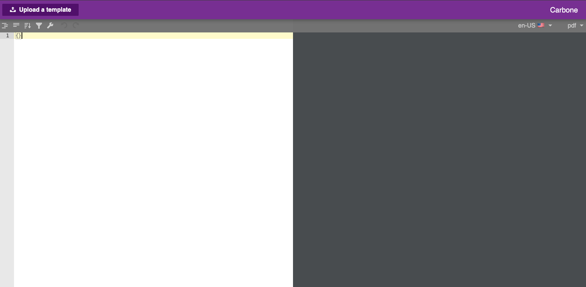

<!-- generated -->

# Carbone

1-Click installation template for Carbone on Easypanel

## Description

Carbone is a high-performance, self-hosted document generation engine. It allows you to generate reports, invoices, and documents in various formats (e.g., PDF, DOCX, XLSX) using JSON data and template-based rendering. Carbone is designed for scalability and speed, making it ideal for automation, bulk document generation, and seamless integration into various systems and workflows. It supports custom templates and advanced features like charts, sub-reports, and conditional formatting to meet a wide range of business needs.

## Benefits

- High-Performance Document Generation: Carbone provides fast and efficient document generation, making it suitable for high-volume environments where speed and reliability are critical.
- Template-Based Rendering: Create templates in familiar formats like DOCX and XLSX, and use JSON data to generate documents without complex coding.
- Multi-Format Support: Generate documents in various formats including PDF, DOCX, XLSX, ODT, and more, allowing flexible output options for different business needs.

## Features

- JSON Data Integration: Use simple JSON data structures to populate templates and generate documents dynamically with minimal setup.
- Customizable Templates: Support for creating custom templates with conditional formatting, sub-reports, and advanced charting options.
- Multi-Language Support: Carbone supports multiple languages for document generation, making it a global solution for businesses.
- REST API: Seamlessly integrate Carbone with other applications using its REST API for automated document generation.
- Cloud and On-Premises: Deploy Carbone in the cloud or on-premises depending on your security and infrastructure requirements.

## Links

- [Documentation](https://carbone.io/documentation/design/overview/getting-started.html)
- [Github](https://github.com/carboneio/carbone)
- [Template Source](https://github.com/easypanel-io/templates/tree/main/templates/carbone)

## Options

Name | Description | Required | Default Value
-|-|-|-
App Service Name | - | yes | carbone
App Service Image | - | yes | carbone/carbone-ee:full-4.25.5
Carbone License Key | - | no | 

## Screenshots

## Change Log

- 2025-02-12 – First Release

## Contributors

- [Ahson Shaikh](https://github.com/Ahson-Shaikh)
