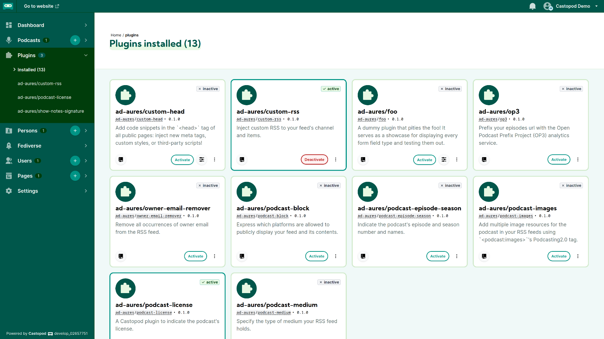

<!-- generated -->

# Castopod

1-Click installation template for Castopod on Easypanel

## Description

Castopod is an open-source hosting platform made for podcasters who want full control over their content. It provides a comprehensive solution for creating, managing, and distributing podcasts with features like built-in analytics, automatic RSS feed generation, and support for the ActivityPub protocol for social interactions. Castopod helps podcasters save time with automatic episode publishing to podcast platforms and social media. The platform includes powerful tools for audience engagement, SEO optimization, and monetization options. With its modern, intuitive interface, Castopod makes podcast hosting accessible while giving creators complete ownership of their content and audience data.

## Instructions

First install the application by going on this path &quot;/cp-install&quot;

## Benefits

- Full Ownership: Host your podcasts on your own infrastructure, maintaining complete control over your content and audience data.
- Built-in Analytics: Access detailed insights about your audience without relying on third-party services or compromising listener privacy.
- Social Features: Engage with your audience through built-in comments, likes, and federation with the Fediverse via ActivityPub.

## Features

- Podcast Management: Create multiple podcasts, manage episodes, and automatically generate RSS feeds compatible with all podcast platforms.
- Automatic Publishing: Save time with automatic episode publishing to podcast directories and social media platforms.
- Embeddable Player: Easily embed a customizable podcast player on any website to showcase your episodes.
- Monetization Options: Integrate with various monetization methods including value-for-value, premium content, and sponsorships.

## Links

- [Website](https://castopod.org/)
- [Documentation](https://docs.castopod.org/)
- [Github](https://github.com/ad-aures/castopod)
- [Template Source](https://github.com/easypanel-io/templates/tree/main/templates/castopod)

## Options

Name | Description | Required | Default Value
-|-|-|-
App Service Name | - | yes | castopod
App Service Image | - | yes | castopod/castopod:1.13.4

## Screenshots

## Change Log

- 2025-03-20 – Initial template release (1.13.4)

## Contributors

- [Ahson Shaikh](https://github.com/Ahson-Shaikh)
