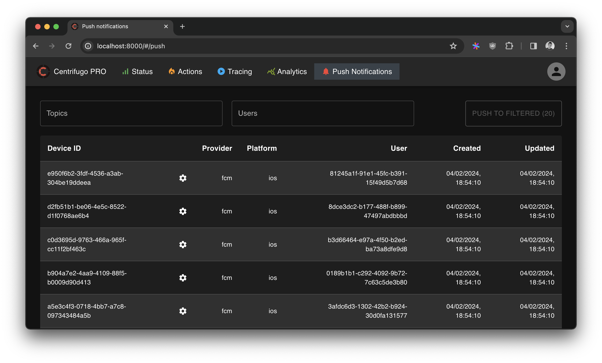

<!-- generated -->

# Centrifugo

1-Click installation template for Centrifugo on Easypanel

## Description

Centrifugo is a scalable real-time messaging server that can be used to add real-time features to your applications. It supports WebSocket and SockJS connections, providing a robust solution for real-time communication.

## Benefits

- Real-time Communication: Enable real-time features in your applications.
- Scalable: Built to handle high loads and scale horizontally.
- WebSocket Support: Native WebSocket and SockJS protocol support.
- Easy Integration: Simple to integrate with existing applications.

## Features

- Web Interface: Built-in web interface for monitoring and management.
- Multiple Protocols: Support for WebSocket, SockJS, and HTTP long-polling.
- Authentication: Flexible authentication and authorization options.
- Channel Management: Efficient channel-based message routing.

## Links

- [Website](https://centrifugal.dev/)
- [Documentation](https://centrifugal.dev/docs/getting-started/introduction)
- [GitHub](https://github.com/centrifugal/centrifugo)
- [Template Source](https://github.com/easypanel-io/templates/tree/main/templates/centrifugo)

## Options

Name | Description | Required | Default Value
-|-|-|-
App Service Name | - | yes | centrifugo
Centrifugo Image | - | yes | centrifugo/centrifugo:v6.1.0
Admin Password | - | yes | password
Admin Secret | - | yes | secret
API Key | - | yes | api-key
HMAC Secret Key | - | yes | secret

## Screenshots

## Change Log

- 2025-04-03 – Initial template release

## Contributors

- [Ahson Shaikh](https://github.com/Ahson-Shaikh)
