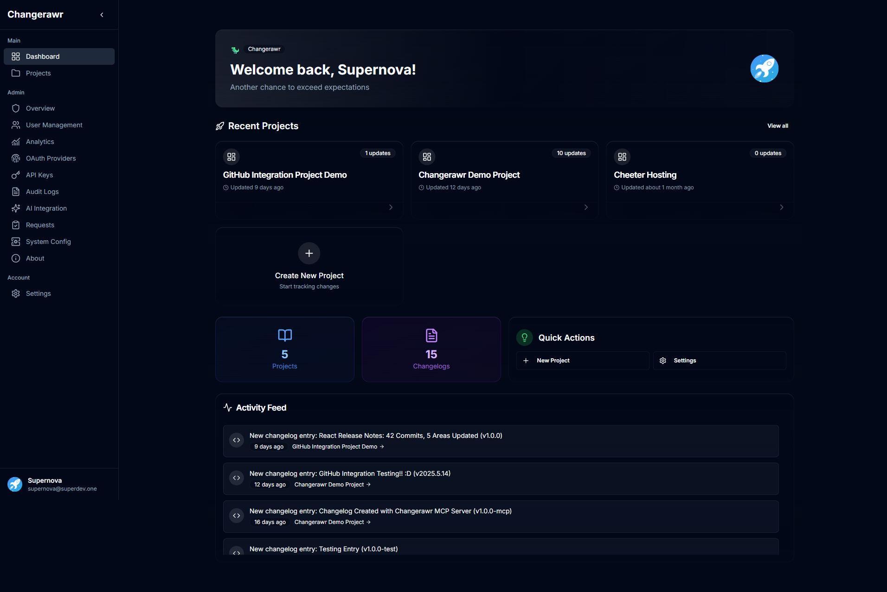

<!-- generated -->

# Changerawr

1-Click installation template for Changerawr on Easypanel

## Description

Changerawr is a modern, open-source change management platform designed to help organizations track, manage, and implement changes efficiently. Built with Next.js and PostgreSQL, it provides a comprehensive solution for change requests, approval workflows, impact assessment, and rollback procedures. The platform features real-time collaboration, automated notifications, audit trails, and detailed reporting capabilities. Perfect for DevOps teams, IT departments, and organizations that need to maintain control over their change management processes while ensuring transparency and accountability.

## Instructions

To enable automatic updates for Changerawr, configure the Easypanel Project ID, Service ID, panel URL and API token in Environment Variables of Changerawr App Service. These configurations allow the system to automatically detect and apply new updates. Make sure not to use CloudFlare Zero Trust, that will causes issues.

## Benefits

- Integrated with Easypanel: Enjoy a seamless experience with Changerawr on Easypanel with SSO and automatic updates.
- Full-text search: Effortlessly browse everything, immediately. All your knowledge in one place, just a key bind away.
- Powerful Content Editor: Buttons, Embeds, Alerts, and more! Write changelogs that look professional to your team and your customers. efficiency.
- Audit Logs: Know everything that happens, when it happens. From approving a request to logging in, you get to know everything that has ever happened.
- AI Powered: Optional AI Integration for increasing your workflow 10x.
- Tags & Versioning: Organize your changelogs exactly how you want with colorful tags and modern versioning.

## Features

- Change Request Management: Create, track, and manage change requests with detailed information, attachments, and categorization for organized change handling.
- Approval Workflows: Configure custom approval workflows with multi-stage approvals, escalation rules, and role-based access control for proper governance.
- Risk Assessment: Built-in risk assessment tools with impact analysis, dependency mapping, and rollback planning for safer change implementation.
- Calendar & Scheduling: Integrated calendar system for scheduling changes, avoiding conflicts, and coordinating implementation timelines across teams.
- Integration Support: GitHub integration and API support for connecting with existing development tools and CI/CD pipelines for seamless workflows.
- Notification System: Automated email and in-app notifications keep stakeholders informed about change status updates, approvals, and deadlines.

## Links

- [Website](https://github.com/supernova3339/changerawr)
- [Github](https://github.com/supernova3339/changerawr)
- [Documentation](https://github.com/supernova3339/changerawr#readme)
- [Template Source](https://github.com/easypanel-io/templates/tree/main/templates/changerawr)

## Options

Name | Description | Required | Default Value
-|-|-|-
App Service Name | - | yes | changerawr
App Service Image | - | yes | ghcr.io/supernova3339/changerawr:v1.0.6
Enable OAuth2 Server | Enable OAuth2 server for Easypanel integration | no | false
OAuth2 Service Image | - | no | ghcr.io/supernova3339/ep-oauth2-serv@sha256:81832fa28a9e109b619f61514b930b3fb7a588845469b5c291297af236209785
Easypanel API Token (OAuth2 sidecar) | Easypanel API token for the OAuth2 service (required when OAuth2 is enabled). Create a token in your Easypanel instance; do not use a placeholder. | no | 
Easypanel URL | Base URL of your Easypanel instance for the OAuth2 sidecar (when OAuth2 is enabled). | no | https://$(EASYPANEL_HOST)
Easypanel Project ID | Project ID from Easypanel for automatic updates (optional; set in the template or later in the app service environment). | no | 
Easypanel Service ID | Service ID from Easypanel for automatic updates (optional; set in the template or later in the app service environment). | no | 
Easypanel API Key (main app) | API key the Changerawr app uses for Easypanel automatic updates (optional; set in the template or later in the app service environment). | no | 

## Screenshots

## Change Log

- 2025-08-08 – First Release (v1.0.4)
- 2026-04-19 – Added website link; pinned OAuth2 sidecar image by digest; removed placeholder Easypanel secrets from schema and generated env
- 2026-04-29 – Version bumped to v1.0.6

## Contributors

- [Ahson Shaikh](https://github.com/Ahson-Shaikh)
