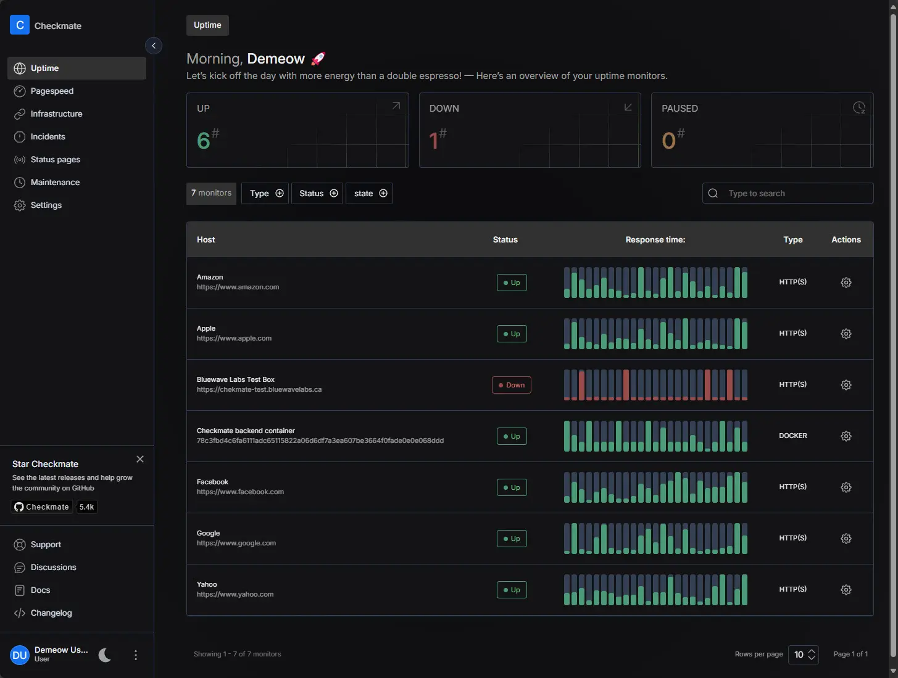

<!-- generated -->

# Checkmate

1-Click installation template for Checkmate on Easypanel

## Description

Checkmate is a modern, open-source uptime monitoring solution designed to keep track of your websites, APIs, and services. Built with a focus on simplicity and reliability, it provides real-time monitoring capabilities with instant notifications when your services go down. The application features a clean, intuitive dashboard that displays the current status of all monitored services, historical uptime data, and detailed analytics. Perfect for businesses, developers, and system administrators who need to ensure their digital services remain accessible to users.

## Instructions

Go to the /register path to register your user.

## Benefits

- Real-Time Monitoring: Continuously monitor your websites, APIs, and services with real-time status updates and instant alerting when issues are detected.
- Comprehensive Dashboard: Clean and intuitive dashboard providing at-a-glance visibility into the health and performance of all your monitored services.
- Historical Analytics: Track uptime trends and performance metrics over time with detailed historical data and analytics for better insights.
- Instant Notifications: Get immediately notified via multiple channels when your services experience downtime or performance issues.
- Easy Configuration: Simple setup process with flexible configuration options to monitor various types of services and endpoints.
- Scalable Architecture: Built with MongoDB and Redis for high performance and scalability to handle monitoring of large numbers of services.

## Features

- Service Health Monitoring: Monitor HTTP/HTTPS endpoints, APIs, and web services with customizable check intervals and timeout settings.
- Uptime Statistics: Detailed uptime percentages and availability statistics with historical data visualization and reporting.
- Alert Management: Configurable alert rules with multiple notification channels including email, webhooks, and third-party integrations.
- Response Time Tracking: Monitor and track response times for your services with performance metrics and trend analysis over time.
- Status Page: Public status pages to communicate service availability to your users and stakeholders transparently.
- Team Collaboration: Multi-user support with role-based access control for team collaboration and shared monitoring responsibilities.

## Links

- [Github](https://github.com/bluewave-labs/checkmate)
- [Documentation](https://github.com/bluewave-labs/checkmate#readme)
- [Website](https://checkmate.so)
- [Template Source](https://github.com/easypanel-io/templates/tree/main/templates/checkmate)

## Options

Name | Description | Required | Default Value
-|-|-|-
App Service Name | - | yes | checkmate
App Service Image | - | yes | ghcr.io/bluewave-labs/checkmate-backend-mono:v3.2.0
MongoDB Service Image | - | no | ghcr.io/bluewave-labs/checkmate-mongo:v3.2.0

## Screenshots

## Change Log

- 2025-08-04 – First release
- 2025-12-25 – Version bumped to v3.2.0

## Contributors

- [Ahson Shaikh](https://github.com/Ahson-Shaikh)
