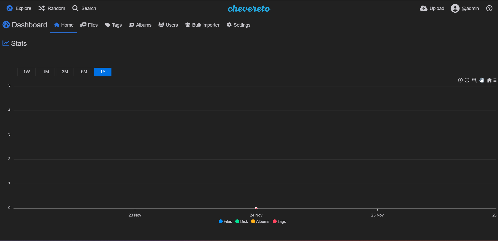

<!-- generated -->

# Chevereto

1-Click installation template for Chevereto on Easypanel

## Description

Chevereto is a powerful, self-hosted image and video hosting platform designed for individuals, communities, and businesses. It allows users to upload, organize, and share media effortlessly. With a clean interface and a wide range of customization options, Chevereto supports private albums, multi-language capabilities, and robust file management, making it the ultimate solution for image and video hosting.

## Instructions

Open the nginx domain to access Chevereto

## Benefits

- Easy Image and Video Hosting: Chevereto provides an intuitive platform for uploading and managing images and video, with support for bulk uploads and organization features.
- Customizable and Extensible: Chevereto offers a wide range of customization options, including themes and API access, to tailor the platform to your needs.
- Multi-Language and Multi-User Support: Operate in multiple languages and create user accounts with varying permission levels, perfect for collaborative environments.

## Features

- Private and Public Albums: Organize images into private or public albums with advanced privacy controls.
- Drag-and-Drop Uploads: Easily upload images by dragging and dropping them into the platform.
- Multi-User Capabilities: Allow multiple users to upload and manage their own images securely within the platform.
- Customizable Appearance: Adjust themes, colors, and layouts to align with your personal or business branding.
- Direct Image Links: Quickly generate direct links for sharing images across social media and other platforms.

## Links

- [Github](https://github.com/chevereto/chevereto)
- [Documentation](https://v4-docs.chevereto.com/)
- [Demo](https://demo.chevereto.com/)
- [Template Source](https://github.com/easypanel-io/templates/tree/main/templates/chevereto)

## Options

Name | Description | Required | Default Value
-|-|-|-
App Service Name | - | yes | chevereto
App Service Image | - | yes | chevereto/chevereto:4

## Screenshots

## Change Log

- 2024-11-22 – First Release

## Contributors

- [Ahson Shaikh](https://github.com/Ahson-Shaikh)
- [Rodolfo Berrios](https://rodolfoberrios.com)
