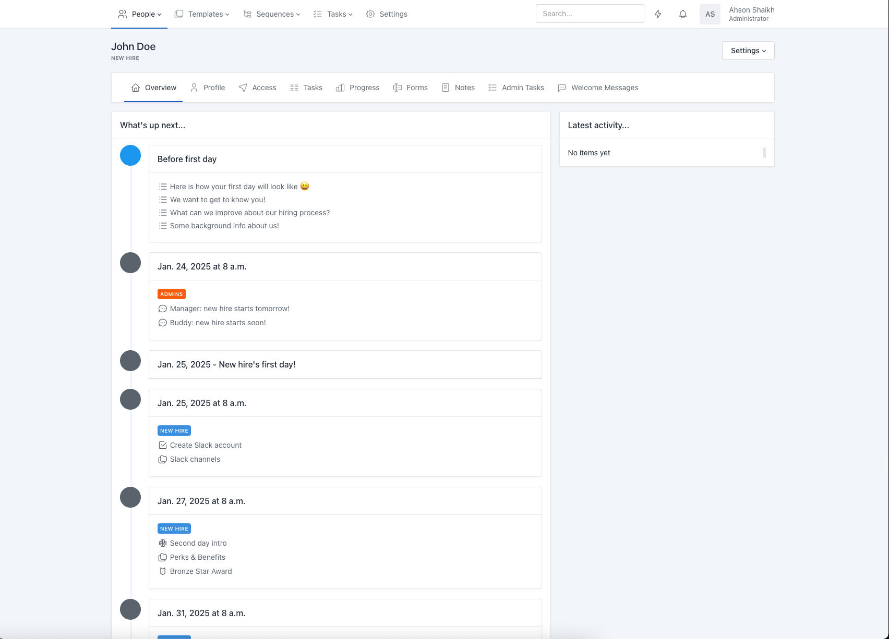

<!-- generated -->

# Chief-Onboarding

1-Click installation template for Chief-Onboarding on Easypanel

## Description

Chief-Onboarding is a comprehensive, self-hosted onboarding and employee management platform designed for businesses to streamline their onboarding processes. It allows organizations to manage employee onboarding, document collection, and task tracking efficiently. With a clean interface and robust customization options, Chief-Onboarding supports role-based access, multi-language capabilities, and seamless integration with existing HR systems, making it the ultimate solution for employee onboarding.

## Benefits

- Streamlined Employee Onboarding: Chief-Onboarding provides an intuitive platform for managing employee onboarding tasks, document collection, and tracking progress seamlessly.
- Customizable and Scalable: Chief-Onboarding offers a wide range of customization options, including workflows and templates, to scale with your business needs.
- Multi-Language and Role-Based Support: Operate in multiple languages and assign roles with varying permission levels, perfect for diverse teams and compliance requirements.

## Features

- Automated Task Management: Streamline task assignments and track progress for a smoother onboarding process.
- Document Collection and Storage: Easily collect and store necessary documents securely in one place.
- Role-Based Access Control: Assign roles and permissions to ensure secure and efficient collaboration.
- Customizable Workflows: Tailor onboarding workflows to fit your organization's unique processes.
- Seamless Integration: Integrate with popular HR and productivity tools for a cohesive ecosystem.

## Links

- [Github](https://github.com/chiefonboarding/chiefonboarding)
- [Documentation](https://docs.chiefonboarding.com/)
- [Demo](https://demo.chiefonboarding.com/)
- [Template Source](https://github.com/easypanel-io/templates/tree/main/templates/chiefonboarding)

## Options

Name | Description | Required | Default Value
-|-|-|-
App Service Name | - | yes | chiefonboarding
App Service Image | - | yes | chiefonboarding/chiefonboarding:v2.2.5

## Screenshots

## Change Log

- 2025-01-20 – First Release

## Contributors

- [Ahson Shaikh](https://github.com/Ahson-Shaikh)
