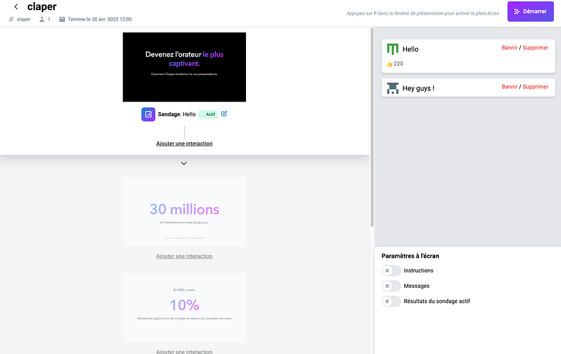

<!-- generated -->

# Claper

1-Click installation template for Claper on Easypanel

## Description

Claper is an interactive presentation platform that transforms passive presentations into engaging, real-time experiences.  With Claper, presenters can create interactive presentations that allow audience members to participate through live polls,  Q&amp;A sessions, reactions, and more. The platform offers seamless integration with popular presentation tools and provides  real-time analytics to help presenters understand audience engagement. Claper supports various presentation formats,  file uploads, and customizable branding options, making it perfect for conferences, webinars, educational sessions,  and corporate meetings.

## Instructions

Click Login on the top right corner and register a new account.

## Benefits

- Interactive Presentations: Transform static presentations into interactive experiences with live polls, Q&A sessions, and real-time audience engagement features.
- Real-time Analytics: Get instant insights into audience engagement and participation with comprehensive analytics and reporting tools.
- Easy Integration: Seamlessly integrate with popular presentation tools and platforms, making it easy to enhance existing workflows.

## Features

- Live Polls & Q&A: Create interactive polls, quizzes, and Q&A sessions that keep your audience engaged throughout the presentation.
- File Upload Support: Upload and manage presentation files with configurable storage options including local and cloud storage.
- Email Integration: Built-in email functionality with SMTP support for notifications, confirmations, and user management.
- Authentication & Security: Secure user authentication with support for OIDC providers and customizable security settings.

## Links

- [Website](https://claper.co/)
- [Documentation](https://docs.claper.co/)
- [Github](https://github.com/ClaperCo/Claper)
- [Template Source](https://github.com/easypanel-io/templates/tree/main/templates/claper)

## Options

Name | Description | Required | Default Value
-|-|-|-
App Service Name | - | yes | claper
App Service Image | - | yes | ghcr.io/claperco/claper:2.4.0

## Screenshots

## Change Log

- 2025-06-30 – Initial release
- 2026-04-29 – Version bumped to 2.4.0

## Contributors

- [Ahson Shaikh](https://github.com/Ahson-Shaikh)
